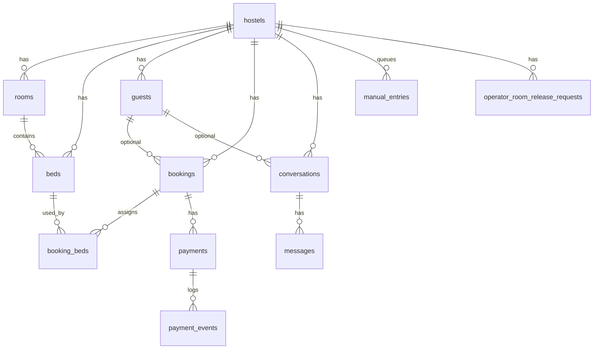

# PostgreSQL Schema Proposal — Wolfhouse Booking Platform

## Design principles

1. **Multi-hostel** — every operational row includes `hostel_id` (FK → `hostels`).
2. **UUID primary keys** — `gen_random_uuid()`; human codes in natural key columns (`booking_code`, `bed_code`).
3. **Airtable cutover** — `airtable_record_id TEXT UNIQUE` where data originated in Airtable.
4. **Parent-driven status** — `booking_beds` do not store independent lifecycle status; derive from `bookings.status` in app/n8n logic (optional generated column later).
5. **Payments** — Stripe is source of truth for `paid`; mirror summary on `bookings.payment_status`.
6. **Audit** — `created_at`, `updated_at` on all operational tables; `workflow_events` and `automation_errors` for ops.

## Entity relationship (core)



## Tables summary

| Table | Purpose |
|-------|---------|
| `hostels` | Tenant (Wolfhouse Somo first) |
| `rooms` | Room metadata & assignment scoring |
| `beds` | Sellable bed inventory |
| `guests` | Normalized guest identity |
| `conversations` | WhatsApp session |
| `messages` | Message log |
| `bookings` | Parent reservation |
| `booking_beds` | Bed-night assignments |
| `packages` | Surf packages (Malibu, Uluwatu, Waimea, Custom) |
| `package_price_rules` | Seasonal EUR per person per week; prorate + ceil to €5 (see `docs/package-pricing.md`) |
| `payments` | Stripe checkout / payment state |
| `payment_events` | Stripe webhook audit trail |
| `manual_entries` | Google Sheets queue mirror |
| `operator_room_release_requests` | Operator block splits |
| `automation_errors` | Central error queue |
| `workflow_events` | Structured execution audit |

## Enums

### `booking_status`

`hold`, `payment_pending`, `confirmed`, `cancelled`, `expired`, `needs_review`, `checked_in`, `blocked`

### `payment_status`

`not_requested`, `waiting_payment`, `deposit_paid`, `paid`, `refunded`, `failed`

### `assignment_status`

`unassigned`, `assigning`, `assigned`, `needs_review`

### `availability_check_status`

`unknown`, `available`, `conflict`, `needs_review`

### `conversation_status` / `bot_mode`

`open`, `closed`, `on_hold` / `bot`, `staff`, `paused`

### `manual_entry_sync_status`

`pending`, `processing`, `synced`, `error`, `deleted`

### `payment_record_status`

`draft`, `checkout_created`, `pending`, `paid`, `expired`, `cancelled`, `failed`

### `automation_error_status`

`open`, `retrying`, `resolved`, `ignored`

## Availability index

```sql
CREATE INDEX idx_booking_beds_availability
  ON booking_beds (hostel_id, bed_id, assignment_start_date, assignment_end_date);
```

Overlap query pattern:

```sql
WHERE hostel_id = $1
  AND bed_id = $2
  AND assignment_start_date < $check_out
  AND assignment_end_date > $check_in
  AND booking_id IN (SELECT id FROM bookings WHERE status NOT IN ('cancelled','expired'));
```

## Fields intentionally omitted (cleanup)

- Airtable `Status - OLD`, `Booking Beds 2/3`
- Duplicate lookup payment fields on booking_beds
- Calendar fields (optional future `booking_calendar_events` table)

## Dual-write period

During migration, n8n nodes write Postgres first, then Airtable (or reverse with feature flag). `airtable_record_id` links rows.

## Implementation files

- DDL: `database/migrations/001_init.sql`
- Seed: `database/seeds/001_wolfhouse_seed.sql`
