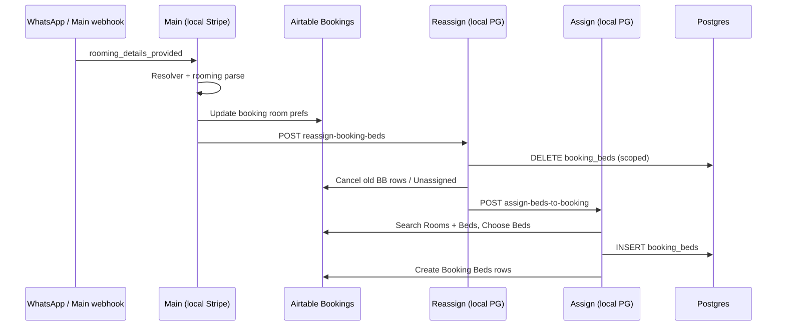

# Phase 3e — Rooming / Reassign (Correct + Safe)

**Status:** **3e.1** inventory complete · **3e.2** Main reassign URL remap complete (static + inactive import, 2026-05-28).  
**No rooming E2E runtime yet** — no POST to Main/reassign, no `booking_beds` mutations.

**Principle (same as payment path):**

| Layer | Role |
|-------|------|
| n8n | Orchestrate |
| Backend / workflow code | Decide (scoring, guards) |
| Postgres | Remember (`rooms`, `beds`, `booking_beds`, `bookings`) |
| Client config / Rooms table | Control rules (not hardcoded room IDs in Main) |
| Staff UI | Manage (later) |

**Ale/Cami / WhatsApp:** Rooming **infrastructure** may proceed; **preference values** stay provisional until Stage 3x owner answers — update `rooms` / config rows, not workflow structure.

---

## 3e.2 — Hosted → local reassign URL remap (done)

| Item | Value |
|------|--------|
| **Removed** | `https://tywoods.app.n8n.cloud/webhook/reassign-booking-beds` |
| **New (HTTP nodes)** | `={{ String($env.N8N_REASSIGN_BOOKING_BEDS_URL \|\| 'http://n8n-main:5678/webhook/reassign-booking-beds').trim() }}` |
| **Nodes** | `Call Reassign Booking Beds - Rooming Update`, `Call Reassign Booking Beds - Rooming Update1` |
| **Source** | `scripts/build-main-local-stripe.js` + `scripts/lib/main-reassign-endpoint.js` |
| **Regenerate** | `node scripts/build-main-local-stripe.js` |
| **Verify** | `node scripts/build-main-local-stripe.js --verify-targets` → hosted hits **0**, local endpoint **OK** |
| **Import (inactive)** | `node scripts/build-main-local-stripe.js --import-inactive` |
| **n8n DB check** | `RBfGNtVgrAkvhBHJ` `active=false`; `has_hosted_reassign=false`; `has_local_reassign=true` |

**Worker DNS:** default `http://n8n-main:5678/...` (same pattern as Assign fork in `build-reassign-beds-local.js`). Override via `N8N_REASSIGN_BOOKING_BEDS_URL` on n8n + n8n-worker when added to compose.

**Not done in 3e.2:** activate Reassign fork; rooming E2E. (**3e.3b** fixed Airtable base alignment — all local bed-ops forks now use test base `appiyO4FmkKsyHZdK`.)

---

## 3e.1 — Inventory and safety plan

Read-only inventory: git state, n8n DB workflow flags, workflow/URL map, Rooms schema, config-driven model, safety gates, provisional vs final rules, gates 3e.2–3e.5.

---

## 1. Git status (3e.1 snapshot)

```
(clean at inventory time — no uncommitted changes)
HEAD: 119fd7e Stage 3x: complete guardrails roadmap, customer memory, and market positioning
```

After doc write: expect uncommitted `docs/PHASE-3e-ROOMING-REASSIGN-PLAN.md` + light `PROJECT-STATE.md` / `ROADMAP.md` updates — **do not commit until reviewed**.

---

## 2. Active workflow state (local n8n DB)

Queried `n8n-postgres.workflow_entity` + `webhook_entity` (read-only).

### Target workflows (payment + Main + rooming chain)

| Workflow | ID | `active` | Webhook registered |
|----------|-----|----------|-------------------|
| Wolfhouse Booking Assistant - Main (local Stripe) | `RBfGNtVgrAkvhBHJ` | **false** | `booking-assistant` (inactive) |
| Wolfhouse - Send Confirmation (local) | `gxivKRJexzTCw9x6` | **false** | `send-confirmation-local` (inactive) |
| Wolfhouse - Stripe Webhook Handler | `KZUQvwR6SPWpvaZ5` | **false** | `stripe-webhook` (inactive) |
| Wolfhouse - Create Payment Session | `esuDIT96iPT63OaQ` | **false** | `create-payment-session` (inactive) |
| Wolfhouse - Create Payment Session (stub local) | `whCreatePaymentStubLocal01` | **false** | `create-payment-session-stub-local` (inactive) |
| Wolfhouse - Reassign Bed Assignments (local PG) | `B3c3ReassignLocal01` | **false** | **not registered** (workflow inactive) |
| Wolfhouse - Bed Assignment (local PG) | `B3c2AssignLocalPg01` | **false** | **not registered** (workflow inactive) |
| Wolfhouse - Cancel Bed Assignments (local PG) | `KchhRC9b3MIdkzPT` | **false** | **not registered** (workflow inactive) |

*(3e.3b snapshot — after `node scripts/import-bed-ops-local-inactive.js --verify-db`; Assign/Cancel were active from Phase 3b until re-import deactivated them.)*

### Send Confirmation schedule

From workflow JSON in DB: node **`Schedule - Poll Postgres`** has **`disabled: true`**. Webhook path remains registered but parent workflow is inactive.

### 3e.1 safety note (bed-ops activation)

After **3e.3b** re-import, Assign / Reassign / Cancel local forks are **inactive** in n8n DB (`active=false`). A direct POST to their webhook paths **will not execute** until explicitly activated for a gated test window (same pattern as payment workflows).

### Static Main check

```bash
node scripts/build-main-local-stripe.js --verify-targets
```

- `workflow.active: false` — OK  
- **WARNING:** hosted reassign URL in `Call Reassign Booking Beds - Rooming Update` and `Call Reassign Booking Beds - Rooming Update1`

---

## 3. Rooming / reassign workflow inventory

### End-to-end path (intended)



**Today (blocked):** Main’s HTTP step still targets **hosted** n8n, not local Reassign.

### Workflows and webhooks

| Workflow | Source file | Stable local ID | Webhook path | Local / hosted | `active` (DB) | Safe for local rooming test? |
|----------|-------------|-----------------|--------------|----------------|---------------|------------------------------|
| Main (rooming route inside) | `n8n/phase2/Wolfhouse Booking Assistant - Main (local Stripe).json` | `RBfGNtVgrAkvhBHJ` | `booking-assistant` | Local fork | false | Only with controlled POST + inactive payment neighbors |
| Reassign Bed Assignments (local PG) | `n8n/phase3b/Wolfhouse - Reassign Bed Assignments (local PG).json` | `B3c3ReassignLocal01` | `reassign-booking-beds` | Local | false | After remap + activate + test booking |
| Bed Assignment (local PG) | `n8n/phase3b/Wolfhouse - Bed Assignment (local PG).json` | `B3c2AssignLocalPg01` | `assign-beds-to-booking` | Local | **true** | Callable today (mutates AT+PG) — isolate |
| Cancel Bed Assignments (local PG) | `n8n/phase3b/Wolfhouse - Cancel Bed Assignments (local PG).json` | `KchhRC9b3MIdkzPT` | `cancel-booking-beds` | Local | **true** | Callable today — isolate |
| Reassign (hosted export) | `n8n/Wolfhouse - Reassign Bed Assignments.json` | *(cloud)* | `reassign-booking-beds` | Hosted (`tywoods.app.n8n.cloud`) | n/a | **Do not use in local tests** |
| Bed Assignment (hosted export) | `n8n/Wolfhouse - Bed Assignment.json` | *(cloud)* | `assign-beds-to-booking` | Hosted | n/a | Do not use |
| Cancel (hosted export) | `n8n/Wolfhouse - Cancel Bed Assignments.json` | *(cloud)* | `cancel-booking-beds` | Hosted | n/a | Do not use |

**Build / regenerate:**

| Command | Output |
|---------|--------|
| `npm run build:reassign-beds:local` | `n8n/phase3b/Wolfhouse - Reassign Bed Assignments (local PG).json` (+ neutralize prod→test AT base, `active=false`) |
| `npm run build:assign-beds:local` | `n8n/phase3b/Wolfhouse - Bed Assignment (local PG).json` |
| `npm run build:cancel-beds:local` | `n8n/phase3b/Wolfhouse - Cancel Bed Assignments (local PG).json` |
| `node scripts/import-bed-ops-local-inactive.js --verify-db` | Regenerate all three + import inactive + read `workflow_entity.active` |
| `npm run build:main:local-stripe` | Main fork (reassign URL remap target: **3e.2**) |

### Main nodes that call reassign (local fork)

| Node | URL (3e.2+) | Trigger context |
|------|-------------|-----------------|
| `Call Reassign Booking Beds - Rooming Update` | `$env.N8N_REASSIGN_BOOKING_BEDS_URL` default `http://n8n-main:5678/webhook/reassign-booking-beds` | After `IF - Needs Bed Reassignment` on rooming path |
| `Call Reassign Booking Beds - Rooming Update1` | Same local-safe URL | Parallel/alternate rooming branch |

**POST body (representative):** `booking_record_id`, `booking_id`, `reason: rooming_preference_update`, `room_preference`, `guest_gender_group_type`, `stay_together`, `rooming_notes`, `preserve_booking_status: true`, `send_guest_reply: false`.

**Router:** `rooming_details_provided` (see `scripts/lib/booking-state-resolver.js`).

**Rooming logic in Main (read-only):** Airtable `Search Rooms - WA` / `Search Rooms - Nearby` + large JS `Code - Check Bed Availability - WA` reads **Fill Priority**, **Private Priority**, **Gender Strategy**, **Capacity**, **Active**, **Often used By Operator** from Rooms records — not hardcoded `R1`…`R10` IDs in scoring (room codes come from data).

**Postgres availability:** `Postgres - Main Availability` uses `rooms` columns via `scripts/lib/main-availability-pg-sql.js` (simplified vs full Main JS).

### Reassign → Assign internal call

| Node | URL |
|------|-----|
| HTTP to Assign (in reassign build) | `process.env.N8N_ASSIGN_WEBHOOK_URL` or default `http://n8n-main:5678/webhook/assign-beds-to-booking` |

From `scripts/build-reassign-beds-local.js`.

### Scripts / reports (read-only helpers)

| Script | Purpose |
|--------|---------|
| `scripts/report-reassign-impact.js` | `db:report:reassign-impact` |
| `scripts/report-assign-impact.js` | `db:report:assign-impact` |
| `scripts/run-reassign-e2e-local.js` | E2E driver (**3e.4+**, not 3e.1) |
| `scripts/test-reassign-beds-webhook.ps1` | Direct webhook POST (**blocked until remap**) |
| `scripts/lib/reassign-booking-beds-pg-sql.js` | Scoped PG delete + mirror |

### Env vars (rooming-related)

| Variable | Used by | Notes |
|----------|---------|-------|
| `N8N_ASSIGN_WEBHOOK_URL` | Reassign build / E2E | Default `http://n8n-main:5678/webhook/assign-beds-to-booking` |
| *(none today)* | Main reassign HTTP | **Gap:** should add `N8N_REASSIGN_BOOKING_BEDS_URL` in **3e.2** (mirror CPS pattern) |

---

## 4. Hosted URL risk

### Exact risk

| Item | Value |
|------|--------|
| Hosted host | `tywoods.app.n8n.cloud` |
| Path | `/webhook/reassign-booking-beds` |
| Full URL | `https://tywoods.app.n8n.cloud/webhook/reassign-booking-beds` |
| Referenced in | Main local fork JSON (2 HTTP nodes) |
| Verified by | `node scripts/build-main-local-stripe.js --verify-targets` |

### Why it is dangerous locally

1. **Leaves local Docker** — hits production n8n Cloud even when Main is “local.”
2. ~~**Airtable base mismatch**~~ — **Fixed in 3e.3b.** Main and Assign/Reassign/Cancel local forks all use test base `appiyO4FmkKsyHZdK` (neutralized from hosted export prod `appOCWIN47Bui9CSS` at build time).
3. **Unscoped blast radius** — hosted reassign resets **all** booking bed rows for a booking in prod AT + downstream assign.

### Local-safe replacement (proposed 3e.2)

| Caller context | URL |
|----------------|-----|
| Main HTTP node (from n8n-main container) | `$env.N8N_REASSIGN_BOOKING_BEDS_URL` default `http://n8n-main:5678/webhook/reassign-booking-beds` |
| Host-side curl / PS test | `http://localhost:5678/webhook/reassign-booking-beds` |

**Also required for 3e.4:**

1. **Activate** `B3c3ReassignLocal01` only in test window (registers webhook).
2. **Align Airtable base** on Reassign + Assign forks with Main test base (or document explicit prod-isolated test records) — separate from URL remap but mandatory for integrated rooming.

---

## 5. Rooms table / config inventory

### Postgres `rooms` (authoritative for local PG scoring)

From `database/migrations/001_init.sql` (+ `client_id` after `003_rename_hostel_to_client.sql`):

| Column | Purpose |
|--------|---------|
| `id` | UUID PK |
| `client_id` | Tenant |
| `airtable_record_id` | Sync key |
| `room_code` | `R1`…`R10` (not “room_id” — code is the business id) |
| `name`, `house` | Display / grouping |
| `room_type` | e.g. `Private-Only` on R6 |
| `capacity` | Max beds |
| `fill_priority` | Lower = fill earlier (shared) |
| `private_priority` | Lower = preferred for private requests |
| `gender_strategy` | Free text today: `Flexible`, `Male preferred`, `Female preferred`, `Mixed ok`, `Private`, … |
| `can_be_matrimonial` | Couple / double-bed capability |
| `often_used_by_operator` | Operator-block preference |
| `sort_order` | Round-robin / display |
| `avoid_until_needed` | **Last-resort** style flag (PG name; AT: “Avoid Until Needed”) |
| `active` | Exclude when false |
| `notes` | Operator notes |

**No dedicated columns yet for:** `manual_lock`, `do_not_move`, `mixed_allowed` as booleans — behavior is encoded in `gender_strategy` / `room_type` / priorities today.

### Postgres `beds`

| Column | Purpose |
|--------|---------|
| `bed_code`, `room_id`, `bed_number`, `bed_label` | Inventory |
| `active`, `sellable` | Eligibility filters |
| `planning_row_label` | Sheet sync |

### Postgres `booking_beds`

Scoped assignment rows: `booking_id`, `bed_id`, date range, denormalized `room_code` / `bed_code`. **Reassign deletes all rows for one resolved booking only** (`reassign-booking-beds-pg-sql.js`).

### Postgres `bookings` (rooming inputs)

`guest_gender_group_type`, `requested_room_type`, `room_preference`, `rooming_notes`, `rooming_confidence`, `needs_rooming_review`, `assignment_status`, `status`.

### Airtable Rooms (`tblrNdFnxdQvEnPuj`)

Documented in [`airtable-field-usage.md`](airtable-field-usage.md): Room ID, Room Type, Capacity, Fill/Private Priority, Gender Strategy, Can be Matrimonial, Often used By Operator, Active, Avoid Until Needed, sort fields.

Main and Assign workflows load these fields at runtime (Airtable search), not hardcoded room lists.

### Live seed snapshot (provisional values — do not treat as final policy)

| room_code | capacity | fill_priority | private_priority | gender_strategy | avoid_until_needed | active | room_type |
|-----------|----------|---------------|------------------|-----------------|-------------------|--------|-----------|
| R1 | 5 | 2 | 5 | Flexible | false | true | |
| R2 | 5 | 3 | 5 | Male preferred | false | true | |
| R3 | 4 | 1 | 2 | Flexible | false | true | |
| R4 | 9 | 9 | 9 | Mixed ok | false | true | |
| R5 | 6 | 4 | 6 | Female preferred | false | true | |
| R6 | 2 | 99 | 1 | Private | false | true | Private-Only |
| R7–R10 | … | … | … | Flexible / Female preferred | false | true | |

**Conclusion:** Table **can** act as configurable rule input; Ale/Cami may change strategies/priorities without workflow rewrites once scoring reads PG/AT config consistently.

---

## 6. Config-driven rooming model

### Rules should come from data

| Rule domain | Config source | Normalized examples (app layer) |
|-------------|---------------|----------------------------------|
| Gender placement | `rooms.gender_strategy` | `female_preferred`, `male_preferred`, `mixed_allowed`, `flexible`, `private_only` |
| Shared fill order | `rooms.fill_priority` | ascending sort |
| Private preference | `rooms.private_priority` + `room_type` / strategy contains `private` | |
| Capacity / sellable beds | `rooms.capacity`, `beds.active`, `beds.sellable` | |
| Last resort | `rooms.avoid_until_needed` | deprioritize until no candidates |
| Operator rooms | `rooms.often_used_by_operator` | staff / block flows |
| Couples | `rooms.can_be_matrimonial` | |
| Active inventory | `rooms.active = true` | |
| Guest intent | `bookings.room_preference`, `guest_gender_group_type` | from conversation |
| Group stay together | session / webhook `stay_together` | future client config |

### Do not hardcode in workflow logic

- “Room 5 is always female” → set `gender_strategy` on `R5`.
- “Room 6 is always private” → `room_type` / `gender_strategy` / `private_priority` on `R6`.
- “Room 4 is last resort” → raise `fill_priority` and/or `avoid_until_needed` on `R4`.

Main JS already interprets strategy strings dynamically (`roomIsFemalePreferred`, `isPrivateLikeRoom`, etc.).

### Future: `config/clients/wolfhouse-somo.json` (Stage 3x)

Map AT/PG enum strings ↔ normalized tokens; optional overrides. Rooming code should read **resolved config**, not branch on raw display strings in multiple places.

---

## 7. Rooming safety gates

Required before any **mutating** rooming/reassign run:

| Gate | Check |
|------|--------|
| Booking identity | Exact `booking_id` (PG UUID) and/or single resolved `airtable_record_id` |
| Booking active | Not terminal (`cancelled`, `expired`; treat `confirmed` per policy — default **no reassign** on confirmed unless explicit test flag) |
| Conversation match | `current_hold_booking_id` / resolver `active_booking` aligns with target |
| Guest count | Known and > 0 |
| Dates | `check_in` / `check_out` present |
| Manual lock | `Assignment Status` ∈ `Assigned`, `Assigning`, `Needs Review` → **block** (Assign fork already gates) |
| No double-booked bed | Overlap queries on `booking_beds` / AT assignments |
| Scoped writes | Only target booking’s `booking_beds` deleted/recreated |
| Room config loaded | Rooms search returned active rows; if empty → handoff |
| Ambiguity | Multiple PG bookings for same code → handoff, no guess |
| Payment isolation | Reassign SQL must not change `payment_status` / `payments` (verified in reassign PG SQL comments) |
| Hosted URL | Main must not call cloud reassign in local test path (**3e.2**) |

**Terminal bookings:** `WH-260528-5369`, `WH-260528-1493` are **confirmed** — do not use for rooming E2E.

**If ambiguous:** staff handoff (`Needs Human` / `bot_mode`), not silent reassignment.

---

## 8. Provisional vs final rules

| Phase | Source of truth | Action |
|-------|-----------------|--------|
| **Provisional (now)** | Postgres seed + Airtable Rooms as synced | Run infrastructure gates; tune table rows only |
| **Final (post 3x.2)** | Ale/Cami answers → `wolfhouse-somo-gaps.md` → `config/clients/wolfhouse-somo.json` + Rooms row updates | Adjust `gender_strategy`, priorities, `avoid_until_needed`, private rules **without** changing workflow graph |

**Examples (config-only changes later):**

- R2 `Male preferred` → `Flexible` if policy changes.
- R4 `fill_priority` 9 → lower if it should not be last resort.
- R6 private protection via `private_priority` / `room_type`, not an `IF room == R6` in Main.

---

## 9. Phase 3e runtime gates (do not run until listed)

| Gate | Scope | Status |
|------|--------|--------|
| **3e.1** | Inventory + safety plan (this doc) | **Done (read-only)** |
| **3e.2** | Hosted reassign URL remap in `build-main-local-stripe.js` + regenerate Main fork; static proof hosted URL gone | **Done** |
| **3e.3** | Static rooming/reassign contract checker (`npm run db:report:main-rooming-contract`) | **Done** |
| **3e.3b** | Align Assign/Reassign/Cancel local forks to test Airtable base (`appiyO4FmkKsyHZdK`); regenerate + import inactive | **Done** (`79ee0e5`) |
| **3e.4a** | Fresh disposable rooming E2E **plan + read-only preflight** (this section) | **Done** |
| **3e.4b** | Fresh disposable **non-terminal** booking; rooming message; verify PG+AT, scoped beds, no payment/confirmation side effects | Planned |
| **3e.5** | Negative tests: wrong booking, confirmed block, multi-active handoff, missing info, assignment lock, private room guard | Planned |

### 3e.3 acceptance (2026-05-28)

- `node scripts/report-main-rooming-contract.js` → **Overall OK: true**
- Proves: Main no hosted reassign; local `n8n-main` endpoint; Main no `booking_beds`/payment writes; Reassign scoped PG delete + parse contract; Assign loads `Search Rooms` + `fill_priority`/`gender_strategy` scoring
- **Blocker found (fixed in 3e.3b):** Airtable base mismatch — Main `appiyO4FmkKsyHZdK` vs Assign/Reassign/Cancel `appOCWIN47Bui9CSS`
- Artifacts: `scripts/lib/main-rooming-contract-inventory.js`, `scripts/report-main-rooming-contract.js`

### 3e.3b acceptance (2026-05-28)

- **Source of truth:** `scripts/lib/bed-ops-local-build.js` — `PROD_AIRTABLE_BASE_ID` → `TEST_AIRTABLE_BASE_ID` via `finalizeLocalBedOpsWorkflow()` in:
  - `scripts/build-assign-beds-local.js`
  - `scripts/build-reassign-beds-local.js`
  - `scripts/build-cancel-beds-local.js`
- Regenerated JSON: zero `appOCWIN47Bui9CSS` hits under `n8n/phase3b/` bed-ops forks; all use `appiyO4FmkKsyHZdK`
- `node scripts/import-bed-ops-local-inactive.js --verify-db` → all three workflows `active=false` in n8n DB
- `node scripts/report-main-rooming-contract.js` → `integrated_e2e_aligned=true`, **Blockers before 3e.4:** none
- Payment/stripe contracts unchanged (`report-main-payment-contract`, `report-stripe-contract`, Main `--verify-targets`)
- **3e.4 may proceed only after this commit + fresh runtime preflight** (activate workflows only in gated window)

### 3e.2 acceptance (preview)

- `node scripts/build-main-local-stripe.js --verify-targets` → **no** hosted reassign warning.
- HTTP nodes use `N8N_REASSIGN_BOOKING_BEDS_URL` with default `http://n8n-main:5678/webhook/reassign-booking-beds`.
- Document Airtable base alignment task for bed forks.

### 3e.4 acceptance (preview — runtime in **3e.4b**)

- New booking e.g. `WH-2605xx-xxxx` in `hold` or `payment_pending`, **not** `WH-260528-5369` / `WH-260528-1493`.
- Main + Reassign + Assign activated only in gated window; deactivated after.
- `booking_beds` count changes only for target `booking_id`.
- `payment_events` / CPS / Send Confirmation / Stripe webhook untouched.

---

## 12. Phase 3e.4a — Runtime plan / preflight (2026-05-28)

**Scope:** read-only planning only. **No** workflow activation, POST, or data mutation in 3e.4a.

**Prerequisite commit:** `79ee0e5` — Phase 3e.3b Airtable base alignment.

**Knowledge gap:** Ale/Cami WhatsApp chat history **not available** (contact/account exports were deleted; not processed). Rooming preferences in this E2E are **provisional** — use current `rooms` / `beds` table config only; do **not** hardcode final business rules in workflows.

### 12.1 Pre-check results (3e.4a snapshot)

| Check | Result |
|-------|--------|
| Git clean | **Yes** (no Ale/Cami ZIPs; `Test-Path` → false) |
| Static rooming contract | **PASS** — `integrated_e2e_aligned=true`, blockers none |
| Main `--verify-targets` | **PASS** — hosted reassign 0, prod AT base 0, Main `booking_beds` writes 0 |
| Payment contract | **PASS** — forbidden payment writes 0 |
| Stripe contract | **PASS** |
| All target workflows inactive | **Yes** — see §12.2 |
| Send Confirmation schedule | **`disabled: true`** in repo JSON + n8n DB nodes blob |

**Read-only baseline SQL (for 3e.4b):**

- `scripts/fixtures/phase3e4a-preflight-n8n.sql` — webhook + execution baselines
- `scripts/fixtures/phase3e4a-preflight-pg.sql` — PG global counts + test-phone collision check

### 12.2 Workflow active state (n8n DB)

| Workflow | ID | `active` | Latest execution |
|----------|-----|----------|------------------|
| Main (local Stripe) | `RBfGNtVgrAkvhBHJ` | **false** | **1064** |
| Reassign (local PG) | `B3c3ReassignLocal01` | **false** | **397** |
| Assign (local PG) | `B3c2AssignLocalPg01` | **false** | **398** |
| Cancel (local PG) | `KchhRC9b3MIdkzPT` | **false** | **305** |
| Send Confirmation (local) | `gxivKRJexzTCw9x6` | **false** | **1077** |
| Stripe Webhook Handler | `KZUQvwR6SPWpvaZ5` | **false** | **1076** |
| Create Payment Session | `esuDIT96iPT63OaQ` | **false** | **1065** |
| CPS stub local | `whCreatePaymentStubLocal01` | **false** | **1037** |

### 12.3 Webhook mappings (n8n DB + JSON)

**Registered in `webhook_entity` while inactive:**

| Path | Method | Workflow | Active |
|------|--------|----------|--------|
| `booking-assistant` | POST | Main (`RBfGNtVgrAkvhBHJ`) | false |

**Not registered while inactive** (expected n8n behavior — registers on activation):

| Path | Expected workflow | JSON source |
|------|-------------------|-------------|
| `reassign-booking-beds` | Reassign `B3c3ReassignLocal01` | `n8n/phase3b/Wolfhouse - Reassign Bed Assignments (local PG).json` |
| `assign-beds-to-booking` | Assign `B3c2AssignLocalPg01` | `n8n/phase3b/Wolfhouse - Bed Assignment (local PG).json` |
| `cancel-booking-beds` | Cancel `KchhRC9b3MIdkzPT` | `n8n/phase3b/Wolfhouse - Cancel Bed Assignments (local PG).json` |

**Duplicate path check:** no duplicate rows for the four paths in `webhook_entity` (query returned 0 duplicates).

**3e.4b pre-activation check:** after activating Assign + Reassign + Main, re-query `webhook_entity` and confirm each path maps to **one** local workflow id (no hosted export collision on local n8n).

### 12.4 Proposed disposable test identity

| Field | Value | Notes |
|-------|-------|-------|
| Phone | `+353399990331` | **0** PG bookings at preflight; not used in 3c/3d evidence |
| POST #1 wamid | `wamid.PHASE3E4.001` | `booking_flow` — bypasses typing guard (`^wamid\.PHASE…`) |
| POST #2 wamid | `wamid.PHASE3E4.002` | `rooming_details_provided` — same phone |
| Dates | `2026-09-22` → `2026-09-24` | 2 nights; avoids overlap with evidence bookings |
| Guest count | `2` | shared-room scenario |
| Env | `WHATSAPP_DRY_RUN=true` | no real Graph API send |

**Do not reuse:** `+353399990329`, `+353399990330`, `WH-260528-5369`, `WH-260528-1493`, `WH-260528-9437`.

### 12.5 Runtime scenario (3e.4b — not executed yet)

**Activation order (before POST #1):**

1. Activate **Assign** (`B3c2AssignLocalPg01`)
2. Activate **Reassign** (`B3c3ReassignLocal01`)
3. Activate **Main** (`RBfGNtVgrAkvhBHJ`)
4. Re-query webhooks — confirm local paths registered
5. Keep **Cancel**, **CPS**, **stub**, **Stripe webhook**, **Send Confirmation** inactive; schedule stays disabled

**POST #1 → Main** (`http://localhost:5678/webhook/booking-assistant`)

Guest message (suggested):

> Hi, we are 2 guests and want to book a shared room from 2026-09-22 to 2026-09-24.

**Expected after POST #1:**

| Check | Expected |
|-------|----------|
| Main execution | success |
| Resolver route | `booking_flow` (not rooming yet) |
| PG booking | new row — `status=hold`, `payment_status=not_requested` |
| PG conversation | created; `current_hold_booking_id` → new booking UUID |
| Airtable test base | hold mirror created (`appiyO4FmkKsyHZdK`) |
| PG `airtable_record_id` | backfilled |
| `booking_beds` | **0** for target booking |
| `payments` / `payment_events` | **unchanged** (baseline 25 / 5) |
| Reassign / Assign | **not called** on booking_flow alone |
| CPS / Stripe / Send Confirmation | **no executions** |

**POST #2 → Main** (same phone, new wamid)

Guest message (suggested):

> We are two friends, one male and one female. Shared room is fine.

**Expected after POST #2:**

| Check | Expected |
|-------|----------|
| Main execution | success |
| Resolver route | `rooming_details_provided` (or overridden sub-route with hold usable) |
| Hold selection | **fresh** booking from POST #1 — not `5369` / `1493` / `9437` |
| Main → Reassign | HTTP to `http://n8n-main:5678/webhook/reassign-booking-beds` |
| Reassign execution | success; scoped PG delete for target booking only |
| Reassign → Assign | HTTP to `http://n8n-main:5678/webhook/assign-beds-to-booking` |
| Assign execution | success; uses **Rooms** table config (`fill_priority`, `gender_strategy`, etc.) |
| `booking_beds` | rows inserted **only** for target `booking_id` |
| Global `booking_beds` | +N for target only; no unrelated booking changes |
| Overlap | no double-booked bed/date conflict for assigned beds |
| Booking status | remains **non-terminal** (`hold` or `payment_pending` — not `confirmed`) |
| Payments | count **25** unchanged |
| `payment_events` | count **5** unchanged |
| Send Confirmation max exec | stays **1077** |
| Stripe webhook max exec | stays **1076** |
| CPS max exec | stays **1065** |
| Real WhatsApp | none (`WHATSAPP_DRY_RUN=true`) |

**Provisional rooming note:** mixed-gender shared room is a **test signal** only until Ale/Cami questionnaire + Rooms config are finalized in Stage 3x.

### 12.6 Baseline checklist (capture immediately before 3e.4b POST #1)

| Baseline | 3e.4a preflight value |
|----------|------------------------|
| Global `payments` | **25** |
| Global `payment_events` | **5** |
| Global `booking_beds` | **13** |
| Active rooms | **10** |
| Sellable beds | **52** |
| Bookings for `+353399990331` | **0** |
| Main latest exec | **1064** |
| Reassign latest exec | **397** |
| Assign latest exec | **398** |
| Cancel latest exec | **305** |
| Send Confirmation latest exec | **1077** |
| Stripe webhook latest exec | **1076** |
| CPS latest exec | **1065** |
| Stub latest exec | **1037** |
| Git HEAD | **`79ee0e5`** |
| Static rooming report | PASS / aligned |

**After POST #1 (3e.4b):** record new `booking_code`, booking UUID, `airtable_record_id`, Main exec id, target `booking_beds` count (=0).

**After POST #2 (3e.4b):** record Main/Reassign/Assign exec ids, target `booking_beds` count (>0), global deltas, Airtable BB row count for target booking.

### 12.7 Hard stops (3e.4b)

Stop immediately (deactivate workflows first) if any of:

- Git dirty before runtime
- Static rooming contract fails or AT base misaligned
- Hosted reassign URL appears in Main execution
- Unexpected workflow active (CPS, Stripe webhook, Send Confirmation, stub)
- Send Confirmation schedule **`disabled` becomes false**
- Main selects wrong booking / hold
- Reassign or Assign touches non-target booking
- Any unrelated `booking_beds` row changes
- Double-booked bed overlap detected
- `payments` count changes
- `payment_events` count changes
- Stripe Webhook Handler executes (exec id > **1076**)
- Send Confirmation executes (exec id > **1077**)
- CPS or stub executes (exec id > **1065** / **1037**)
- Real WhatsApp Graph API call (verify `WHATSAPP_DRY_RUN=true`)
- Cannot deactivate workflows after test
- Any execution failure — **no automatic retry**

### 12.8 Activation boundary

| Activate for 3e.4b | Keep inactive |
|--------------------|---------------|
| Main | Stripe Webhook Handler |
| Reassign | Send Confirmation |
| Assign | Create Payment Session |
| *(Cancel only if explicit cancel path needed — Reassign path does not require Cancel)* | CPS stub |
| | Send Confirmation schedule (`disabled: true`) |

### 12.9 Cleanup policy (after 3e.4b)

1. Deactivate Main → Reassign → Assign → Cancel (if activated).
2. Re-query `workflow_entity` — all target workflows **`active=false`**.
3. Re-query `webhook_entity` — bed-ops paths should unregister when inactive.
4. **Keep evidence booking** on success (do not auto-delete PG/AT rows).
5. If unsafe side effect: deactivate first, document cleanup recommendation; **do not** auto-clean data.
6. Delete temp payload JSON files used for POSTs.
7. Re-run static rooming contract report.

### 12.10 3e.4a acceptance

- Read-only preflight complete; all static gates PASS.
- Disposable identity proposed; baselines captured.
- Runtime scenario, hard stops, activation boundary, and cleanup documented.
- **No runtime performed in 3e.4a.**

---

## 10. Related docs

- [`PHASE-3b-FREEZE.md`](PHASE-3b-FREEZE.md) — bed-ops forks  
- [`PHASE-3c-PROPOSAL.md`](PHASE-3c-PROPOSAL.md) — `rooming_details_provided` route  
- [`STAGE-3x-BOT-KNOWLEDGE-GUARDRAILS.md`](STAGE-3x-BOT-KNOWLEDGE-GUARDRAILS.md) — rooming handoff / wrong-booking  
- [`airtable-field-usage.md`](airtable-field-usage.md) — Rooms / Booking Beds fields  
- [`current-system-map.md`](current-system-map.md) — hosted architecture reference  

---

## 11. Recommendation

1. **Commit** 3e.4a plan/preflight docs (+ read-only SQL fixtures if included).  
2. **3e.4b** — execute gated runtime with phone `+353399990331`; fresh preflight immediately before activation.  
3. Keep payment/confirmation/Stripe inactive outside explicit test windows.

**Static gate for 3e.4b is clear.** Ale/Cami rooming preferences remain provisional until Stage 3x questionnaire data exists.
