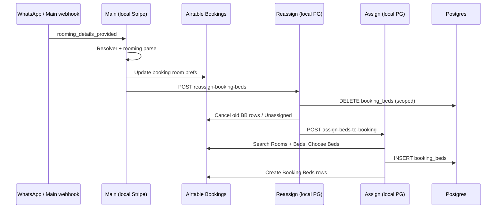

# Phase 3e — Rooming / Reassign (Correct + Safe)

**Status:** **3e.1** inventory complete · **3e.2** Main reassign URL remap complete (static + inactive import, 2026-05-28).  
**No rooming E2E runtime yet** — no POST to Main/reassign, no `booking_beds` mutations.

**Principle (same as payment path):**

| Layer | Role |
|-------|------|
| n8n | Orchestrate |
| Backend / workflow code | Decide (scoring, guards) |
| Postgres | Remember (`rooms`, `beds`, `booking_beds`, `bookings`) |
| Client config / Rooms table | Control rules (not hardcoded room IDs in Main) |
| Staff UI | Manage (later) |

**Ale/Cami / WhatsApp:** Rooming **infrastructure** may proceed; **preference values** stay provisional until Stage 3x owner answers — update `rooms` / config rows, not workflow structure.

---

## 3e.2 — Hosted → local reassign URL remap (done)

| Item | Value |
|------|--------|
| **Removed** | `https://tywoods.app.n8n.cloud/webhook/reassign-booking-beds` |
| **New (HTTP nodes)** | `={{ String($env.N8N_REASSIGN_BOOKING_BEDS_URL \|\| 'http://n8n-main:5678/webhook/reassign-booking-beds').trim() }}` |
| **Nodes** | `Call Reassign Booking Beds - Rooming Update`, `Call Reassign Booking Beds - Rooming Update1` |
| **Source** | `scripts/build-main-local-stripe.js` + `scripts/lib/main-reassign-endpoint.js` |
| **Regenerate** | `node scripts/build-main-local-stripe.js` |
| **Verify** | `node scripts/build-main-local-stripe.js --verify-targets` → hosted hits **0**, local endpoint **OK** |
| **Import (inactive)** | `node scripts/build-main-local-stripe.js --import-inactive` |
| **n8n DB check** | `RBfGNtVgrAkvhBHJ` `active=false`; `has_hosted_reassign=false`; `has_local_reassign=true` |

**Worker DNS:** default `http://n8n-main:5678/...` (same pattern as Assign fork in `build-reassign-beds-local.js`). Override via `N8N_REASSIGN_BOOKING_BEDS_URL` on n8n + n8n-worker when added to compose.

**Not done in 3e.2:** activate Reassign fork; rooming E2E. (**3e.3b** fixed Airtable base alignment — all local bed-ops forks now use test base `appiyO4FmkKsyHZdK`.)

---

## 3e.1 — Inventory and safety plan

Read-only inventory: git state, n8n DB workflow flags, workflow/URL map, Rooms schema, config-driven model, safety gates, provisional vs final rules, gates 3e.2–3e.5.

---

## 1. Git status (3e.1 snapshot)

```
(clean at inventory time — no uncommitted changes)
HEAD: 119fd7e Stage 3x: complete guardrails roadmap, customer memory, and market positioning
```

After doc write: expect uncommitted `docs/PHASE-3e-ROOMING-REASSIGN-PLAN.md` + light `PROJECT-STATE.md` / `ROADMAP.md` updates — **do not commit until reviewed**.

---

## 2. Active workflow state (local n8n DB)

Queried `n8n-postgres.workflow_entity` + `webhook_entity` (read-only).

### Target workflows (payment + Main + rooming chain)

| Workflow | ID | `active` | Webhook registered |
|----------|-----|----------|-------------------|
| Wolfhouse Booking Assistant - Main (local Stripe) | `RBfGNtVgrAkvhBHJ` | **false** | `booking-assistant` (inactive) |
| Wolfhouse - Send Confirmation (local) | `gxivKRJexzTCw9x6` | **false** | `send-confirmation-local` (inactive) |
| Wolfhouse - Stripe Webhook Handler | `KZUQvwR6SPWpvaZ5` | **false** | `stripe-webhook` (inactive) |
| Wolfhouse - Create Payment Session | `esuDIT96iPT63OaQ` | **false** | `create-payment-session` (inactive) |
| Wolfhouse - Create Payment Session (stub local) | `whCreatePaymentStubLocal01` | **false** | `create-payment-session-stub-local` (inactive) |
| Wolfhouse - Reassign Bed Assignments (local PG) | `B3c3ReassignLocal01` | **false** | **not registered** (workflow inactive) |
| Wolfhouse - Bed Assignment (local PG) | `B3c2AssignLocalPg01` | **false** | **not registered** (workflow inactive) |
| Wolfhouse - Cancel Bed Assignments (local PG) | `KchhRC9b3MIdkzPT` | **false** | **not registered** (workflow inactive) |

*(3e.3b snapshot — after `node scripts/import-bed-ops-local-inactive.js --verify-db`; Assign/Cancel were active from Phase 3b until re-import deactivated them.)*

### Send Confirmation schedule

From workflow JSON in DB: node **`Schedule - Poll Postgres`** has **`disabled: true`**. Webhook path remains registered but parent workflow is inactive.

### 3e.1 safety note (bed-ops activation)

After **3e.3b** re-import, Assign / Reassign / Cancel local forks are **inactive** in n8n DB (`active=false`). A direct POST to their webhook paths **will not execute** until explicitly activated for a gated test window (same pattern as payment workflows).

### Static Main check

```bash
node scripts/build-main-local-stripe.js --verify-targets
```

- `workflow.active: false` — OK  
- **WARNING:** hosted reassign URL in `Call Reassign Booking Beds - Rooming Update` and `Call Reassign Booking Beds - Rooming Update1`

---

## 3. Rooming / reassign workflow inventory

### End-to-end path (intended)



**Today (blocked):** Main’s HTTP step still targets **hosted** n8n, not local Reassign.

### Workflows and webhooks

| Workflow | Source file | Stable local ID | Webhook path | Local / hosted | `active` (DB) | Safe for local rooming test? |
|----------|-------------|-----------------|--------------|----------------|---------------|------------------------------|
| Main (rooming route inside) | `n8n/phase2/Wolfhouse Booking Assistant - Main (local Stripe).json` | `RBfGNtVgrAkvhBHJ` | `booking-assistant` | Local fork | false | Only with controlled POST + inactive payment neighbors |
| Reassign Bed Assignments (local PG) | `n8n/phase3b/Wolfhouse - Reassign Bed Assignments (local PG).json` | `B3c3ReassignLocal01` | `reassign-booking-beds` | Local | false | After remap + activate + test booking |
| Bed Assignment (local PG) | `n8n/phase3b/Wolfhouse - Bed Assignment (local PG).json` | `B3c2AssignLocalPg01` | `assign-beds-to-booking` | Local | **true** | Callable today (mutates AT+PG) — isolate |
| Cancel Bed Assignments (local PG) | `n8n/phase3b/Wolfhouse - Cancel Bed Assignments (local PG).json` | `KchhRC9b3MIdkzPT` | `cancel-booking-beds` | Local | **true** | Callable today — isolate |
| Reassign (hosted export) | `n8n/Wolfhouse - Reassign Bed Assignments.json` | *(cloud)* | `reassign-booking-beds` | Hosted (`tywoods.app.n8n.cloud`) | n/a | **Do not use in local tests** |
| Bed Assignment (hosted export) | `n8n/Wolfhouse - Bed Assignment.json` | *(cloud)* | `assign-beds-to-booking` | Hosted | n/a | Do not use |
| Cancel (hosted export) | `n8n/Wolfhouse - Cancel Bed Assignments.json` | *(cloud)* | `cancel-booking-beds` | Hosted | n/a | Do not use |

**Build / regenerate:**

| Command | Output |
|---------|--------|
| `npm run build:reassign-beds:local` | `n8n/phase3b/Wolfhouse - Reassign Bed Assignments (local PG).json` (+ neutralize prod→test AT base, `active=false`) |
| `npm run build:assign-beds:local` | `n8n/phase3b/Wolfhouse - Bed Assignment (local PG).json` |
| `npm run build:cancel-beds:local` | `n8n/phase3b/Wolfhouse - Cancel Bed Assignments (local PG).json` |
| `node scripts/import-bed-ops-local-inactive.js --verify-db` | Regenerate all three + import inactive + read `workflow_entity.active` |
| `npm run build:main:local-stripe` | Main fork (reassign URL remap target: **3e.2**) |

### Main nodes that call reassign (local fork)

| Node | URL (3e.2+) | Trigger context |
|------|-------------|-----------------|
| `Call Reassign Booking Beds - Rooming Update` | `$env.N8N_REASSIGN_BOOKING_BEDS_URL` default `http://n8n-main:5678/webhook/reassign-booking-beds` | After `IF - Needs Bed Reassignment` on rooming path |
| `Call Reassign Booking Beds - Rooming Update1` | Same local-safe URL | Parallel/alternate rooming branch |

**POST body (representative):** `booking_record_id`, `booking_id`, `reason: rooming_preference_update`, `room_preference`, `guest_gender_group_type`, `stay_together`, `rooming_notes`, `preserve_booking_status: true`, `send_guest_reply: false`.

**Router:** `rooming_details_provided` (see `scripts/lib/booking-state-resolver.js`).

**Rooming logic in Main (read-only):** Airtable `Search Rooms - WA` / `Search Rooms - Nearby` + large JS `Code - Check Bed Availability - WA` reads **Fill Priority**, **Private Priority**, **Gender Strategy**, **Capacity**, **Active**, **Often used By Operator** from Rooms records — not hardcoded `R1`…`R10` IDs in scoring (room codes come from data).

**Postgres availability:** `Postgres - Main Availability` uses `rooms` columns via `scripts/lib/main-availability-pg-sql.js` (simplified vs full Main JS).

### Reassign → Assign internal call

| Node | URL |
|------|-----|
| HTTP to Assign (in reassign build) | `process.env.N8N_ASSIGN_WEBHOOK_URL` or default `http://n8n-main:5678/webhook/assign-beds-to-booking` |

From `scripts/build-reassign-beds-local.js`.

### Scripts / reports (read-only helpers)

| Script | Purpose |
|--------|---------|
| `scripts/report-reassign-impact.js` | `db:report:reassign-impact` |
| `scripts/report-assign-impact.js` | `db:report:assign-impact` |
| `scripts/run-reassign-e2e-local.js` | E2E driver (**3e.4+**, not 3e.1) |
| `scripts/test-reassign-beds-webhook.ps1` | Direct webhook POST (**blocked until remap**) |
| `scripts/lib/reassign-booking-beds-pg-sql.js` | Scoped PG delete + mirror |

### Env vars (rooming-related)

| Variable | Used by | Notes |
|----------|---------|-------|
| `N8N_ASSIGN_WEBHOOK_URL` | Reassign build / E2E | Default `http://n8n-main:5678/webhook/assign-beds-to-booking` |
| *(none today)* | Main reassign HTTP | **Gap:** should add `N8N_REASSIGN_BOOKING_BEDS_URL` in **3e.2** (mirror CPS pattern) |

---

## 4. Hosted URL risk

### Exact risk

| Item | Value |
|------|--------|
| Hosted host | `tywoods.app.n8n.cloud` |
| Path | `/webhook/reassign-booking-beds` |
| Full URL | `https://tywoods.app.n8n.cloud/webhook/reassign-booking-beds` |
| Referenced in | Main local fork JSON (2 HTTP nodes) |
| Verified by | `node scripts/build-main-local-stripe.js --verify-targets` |

### Why it is dangerous locally

1. **Leaves local Docker** — hits production n8n Cloud even when Main is “local.”
2. ~~**Airtable base mismatch**~~ — **Fixed in 3e.3b.** Main and Assign/Reassign/Cancel local forks all use test base `appiyO4FmkKsyHZdK` (neutralized from hosted export prod `appOCWIN47Bui9CSS` at build time).
3. **Unscoped blast radius** — hosted reassign resets **all** booking bed rows for a booking in prod AT + downstream assign.

### Local-safe replacement (proposed 3e.2)

| Caller context | URL |
|----------------|-----|
| Main HTTP node (from n8n-main container) | `$env.N8N_REASSIGN_BOOKING_BEDS_URL` default `http://n8n-main:5678/webhook/reassign-booking-beds` |
| Host-side curl / PS test | `http://localhost:5678/webhook/reassign-booking-beds` |

**Also required for 3e.4:**

1. **Activate** `B3c3ReassignLocal01` only in test window (registers webhook).
2. **Align Airtable base** on Reassign + Assign forks with Main test base (or document explicit prod-isolated test records) — separate from URL remap but mandatory for integrated rooming.

---

## 5. Rooms table / config inventory

### Postgres `rooms` (authoritative for local PG scoring)

From `database/migrations/001_init.sql` (+ `client_id` after `003_rename_hostel_to_client.sql`):

| Column | Purpose |
|--------|---------|
| `id` | UUID PK |
| `client_id` | Tenant |
| `airtable_record_id` | Sync key |
| `room_code` | `R1`…`R10` (not “room_id” — code is the business id) |
| `name`, `house` | Display / grouping |
| `room_type` | e.g. `Private-Only` on R6 |
| `capacity` | Max beds |
| `fill_priority` | Lower = fill earlier (shared) |
| `private_priority` | Lower = preferred for private requests |
| `gender_strategy` | Free text today: `Flexible`, `Male preferred`, `Female preferred`, `Mixed ok`, `Private`, … |
| `can_be_matrimonial` | Couple / double-bed capability |
| `often_used_by_operator` | Operator-block preference |
| `sort_order` | Round-robin / display |
| `avoid_until_needed` | **Last-resort** style flag (PG name; AT: “Avoid Until Needed”) |
| `active` | Exclude when false |
| `notes` | Operator notes |

**No dedicated columns yet for:** `manual_lock`, `do_not_move`, `mixed_allowed` as booleans — behavior is encoded in `gender_strategy` / `room_type` / priorities today.

### Postgres `beds`

| Column | Purpose |
|--------|---------|
| `bed_code`, `room_id`, `bed_number`, `bed_label` | Inventory |
| `active`, `sellable` | Eligibility filters |
| `planning_row_label` | Sheet sync |

### Postgres `booking_beds`

Scoped assignment rows: `booking_id`, `bed_id`, date range, denormalized `room_code` / `bed_code`. **Reassign deletes all rows for one resolved booking only** (`reassign-booking-beds-pg-sql.js`).

### Postgres `bookings` (rooming inputs)

`guest_gender_group_type`, `requested_room_type`, `room_preference`, `rooming_notes`, `rooming_confidence`, `needs_rooming_review`, `assignment_status`, `status`.

### Airtable Rooms (`tblrNdFnxdQvEnPuj`)

Documented in [`airtable-field-usage.md`](airtable-field-usage.md): Room ID, Room Type, Capacity, Fill/Private Priority, Gender Strategy, Can be Matrimonial, Often used By Operator, Active, Avoid Until Needed, sort fields.

Main and Assign workflows load these fields at runtime (Airtable search), not hardcoded room lists.

### Live seed snapshot (provisional values — do not treat as final policy)

| room_code | capacity | fill_priority | private_priority | gender_strategy | avoid_until_needed | active | room_type |
|-----------|----------|---------------|------------------|-----------------|-------------------|--------|-----------|
| R1 | 5 | 2 | 5 | Flexible | false | true | |
| R2 | 5 | 3 | 5 | Male preferred | false | true | |
| R3 | 4 | 1 | 2 | Flexible | false | true | |
| R4 | 9 | 9 | 9 | Mixed ok | false | true | |
| R5 | 6 | 4 | 6 | Female preferred | false | true | |
| R6 | 2 | 99 | 1 | Private | false | true | Private-Only |
| R7–R10 | … | … | … | Flexible / Female preferred | false | true | |

**Conclusion:** Table **can** act as configurable rule input; Ale/Cami may change strategies/priorities without workflow rewrites once scoring reads PG/AT config consistently.

---

## 6. Config-driven rooming model

### Rules should come from data

| Rule domain | Config source | Normalized examples (app layer) |
|-------------|---------------|----------------------------------|
| Gender placement | `rooms.gender_strategy` | `female_preferred`, `male_preferred`, `mixed_allowed`, `flexible`, `private_only` |
| Shared fill order | `rooms.fill_priority` | ascending sort |
| Private preference | `rooms.private_priority` + `room_type` / strategy contains `private` | |
| Capacity / sellable beds | `rooms.capacity`, `beds.active`, `beds.sellable` | |
| Last resort | `rooms.avoid_until_needed` | deprioritize until no candidates |
| Operator rooms | `rooms.often_used_by_operator` | staff / block flows |
| Couples | `rooms.can_be_matrimonial` | |
| Active inventory | `rooms.active = true` | |
| Guest intent | `bookings.room_preference`, `guest_gender_group_type` | from conversation |
| Group stay together | session / webhook `stay_together` | future client config |

### Do not hardcode in workflow logic

- “Room 5 is always female” → set `gender_strategy` on `R5`.
- “Room 6 is always private” → `room_type` / `gender_strategy` / `private_priority` on `R6`.
- “Room 4 is last resort” → raise `fill_priority` and/or `avoid_until_needed` on `R4`.

Main JS already interprets strategy strings dynamically (`roomIsFemalePreferred`, `isPrivateLikeRoom`, etc.).

### Future: `config/clients/wolfhouse-somo.json` (Stage 3x)

Map AT/PG enum strings ↔ normalized tokens; optional overrides. Rooming code should read **resolved config**, not branch on raw display strings in multiple places.

---

## 7. Rooming safety gates

Required before any **mutating** rooming/reassign run:

| Gate | Check |
|------|--------|
| Booking identity | Exact `booking_id` (PG UUID) and/or single resolved `airtable_record_id` |
| Booking active | Not terminal (`cancelled`, `expired`; treat `confirmed` per policy — default **no reassign** on confirmed unless explicit test flag) |
| Conversation match | `current_hold_booking_id` / resolver `active_booking` aligns with target |
| Guest count | Known and > 0 |
| Dates | `check_in` / `check_out` present |
| Manual lock | `Assignment Status` ∈ `Assigned`, `Assigning`, `Needs Review` → **block** (Assign fork already gates) |
| No double-booked bed | Overlap queries on `booking_beds` / AT assignments |
| Scoped writes | Only target booking’s `booking_beds` deleted/recreated |
| Room config loaded | Rooms search returned active rows; if empty → handoff |
| Ambiguity | Multiple PG bookings for same code → handoff, no guess |
| Payment isolation | Reassign SQL must not change `payment_status` / `payments` (verified in reassign PG SQL comments) |
| Hosted URL | Main must not call cloud reassign in local test path (**3e.2**) |

**Terminal bookings:** `WH-260528-5369`, `WH-260528-1493` are **confirmed** — do not use for rooming E2E.

**If ambiguous:** staff handoff (`Needs Human` / `bot_mode`), not silent reassignment.

---

## 8. Provisional vs final rules

| Phase | Source of truth | Action |
|-------|-----------------|--------|
| **Provisional (now)** | Postgres seed + Airtable Rooms as synced | Run infrastructure gates; tune table rows only |
| **Final (post 3x.2)** | Ale/Cami answers → `wolfhouse-somo-gaps.md` → `config/clients/wolfhouse-somo.json` + Rooms row updates | Adjust `gender_strategy`, priorities, `avoid_until_needed`, private rules **without** changing workflow graph |

**Examples (config-only changes later):**

- R2 `Male preferred` → `Flexible` if policy changes.
- R4 `fill_priority` 9 → lower if it should not be last resort.
- R6 private protection via `private_priority` / `room_type`, not an `IF room == R6` in Main.

---

## 9. Phase 3e runtime gates (do not run until listed)

| Gate | Scope | Status |
|------|--------|--------|
| **3e.1** | Inventory + safety plan (this doc) | **Done (read-only)** |
| **3e.2** | Hosted reassign URL remap in `build-main-local-stripe.js` + regenerate Main fork; static proof hosted URL gone | **Done** |
| **3e.3** | Static rooming/reassign contract checker (`npm run db:report:main-rooming-contract`) | **Done** |
| **3e.3b** | Align Assign/Reassign/Cancel local forks to test Airtable base (`appiyO4FmkKsyHZdK`); regenerate + import inactive | **Done** (`79ee0e5`) |
| **3e.4a** | Fresh disposable rooming E2E **plan + read-only preflight** (this section) | **Done** |
| **3e.4b** | Fresh disposable **non-terminal** booking; rooming message; verify PG+AT, scoped beds, no payment/confirmation side effects | **Done — PASS** (retry after 3e.4c; see §13) |
| **3e.4c** | Forensics: Main→Reassign payload contract mismatch; minimal patch + static regen | **Done** (`be4efce`) |
| **3e.5** | Negative / wrong-booking guard tests (T1–T7) — see §14 | **3e.5a L1 PASS + 3e.5b L2 PASS** (T1–T3, T5–T7); **3e.5 CLOSED for Stage 3** — L3 runtime deferred to Postgres source-of-truth cutover (§15.6/§15.7) |

### 3e.3 acceptance (2026-05-28)

- `node scripts/report-main-rooming-contract.js` → **Overall OK: true**
- Proves: Main no hosted reassign; local `n8n-main` endpoint; Main no `booking_beds`/payment writes; Reassign scoped PG delete + parse contract; Assign loads `Search Rooms` + `fill_priority`/`gender_strategy` scoring
- **Blocker found (fixed in 3e.3b):** Airtable base mismatch — Main `appiyO4FmkKsyHZdK` vs Assign/Reassign/Cancel `appOCWIN47Bui9CSS`
- Artifacts: `scripts/lib/main-rooming-contract-inventory.js`, `scripts/report-main-rooming-contract.js`

### 3e.3b acceptance (2026-05-28)

- **Source of truth:** `scripts/lib/bed-ops-local-build.js` — `PROD_AIRTABLE_BASE_ID` → `TEST_AIRTABLE_BASE_ID` via `finalizeLocalBedOpsWorkflow()` in:
  - `scripts/build-assign-beds-local.js`
  - `scripts/build-reassign-beds-local.js`
  - `scripts/build-cancel-beds-local.js`
- Regenerated JSON: zero `appOCWIN47Bui9CSS` hits under `n8n/phase3b/` bed-ops forks; all use `appiyO4FmkKsyHZdK`
- `node scripts/import-bed-ops-local-inactive.js --verify-db` → all three workflows `active=false` in n8n DB
- `node scripts/report-main-rooming-contract.js` → `integrated_e2e_aligned=true`, **Blockers before 3e.4:** none
- Payment/stripe contracts unchanged (`report-main-payment-contract`, `report-stripe-contract`, Main `--verify-targets`)
- **3e.4 may proceed only after this commit + fresh runtime preflight** (activate workflows only in gated window)

### 3e.2 acceptance (preview)

- `node scripts/build-main-local-stripe.js --verify-targets` → **no** hosted reassign warning.
- HTTP nodes use `N8N_REASSIGN_BOOKING_BEDS_URL` with default `http://n8n-main:5678/webhook/reassign-booking-beds`.
- Document Airtable base alignment task for bed forks.

### 3e.4 acceptance (preview — runtime in **3e.4b**)

- New booking e.g. `WH-2605xx-xxxx` in `hold` or `payment_pending`, **not** `WH-260528-5369` / `WH-260528-1493`.
- Main + Reassign + Assign activated only in gated window; deactivated after.
- `booking_beds` count changes only for target `booking_id`.
- `payment_events` / CPS / Send Confirmation / Stripe webhook untouched.

---

## 12. Phase 3e.4a — Runtime plan / preflight (2026-05-28)

**Scope:** read-only planning only. **No** workflow activation, POST, or data mutation in 3e.4a.

**Prerequisite commit:** `79ee0e5` — Phase 3e.3b Airtable base alignment.

**Knowledge gap:** Ale/Cami WhatsApp chat history **not available** (contact/account exports were deleted; not processed). Rooming preferences in this E2E are **provisional** — use current `rooms` / `beds` table config only; do **not** hardcode final business rules in workflows.

### 12.1 Pre-check results (3e.4a snapshot)

| Check | Result |
|-------|--------|
| Git clean | **Yes** (no Ale/Cami ZIPs; `Test-Path` → false) |
| Static rooming contract | **PASS** — `integrated_e2e_aligned=true`, blockers none |
| Main `--verify-targets` | **PASS** — hosted reassign 0, prod AT base 0, Main `booking_beds` writes 0 |
| Payment contract | **PASS** — forbidden payment writes 0 |
| Stripe contract | **PASS** |
| All target workflows inactive | **Yes** — see §12.2 |
| Send Confirmation schedule | **`disabled: true`** in repo JSON + n8n DB nodes blob |

**Read-only baseline SQL (for 3e.4b):**

- `scripts/fixtures/phase3e4a-preflight-n8n.sql` — webhook + execution baselines
- `scripts/fixtures/phase3e4a-preflight-pg.sql` — PG global counts + test-phone collision check

### 12.2 Workflow active state (n8n DB)

| Workflow | ID | `active` | Latest execution |
|----------|-----|----------|------------------|
| Main (local Stripe) | `RBfGNtVgrAkvhBHJ` | **false** | **1064** |
| Reassign (local PG) | `B3c3ReassignLocal01` | **false** | **397** |
| Assign (local PG) | `B3c2AssignLocalPg01` | **false** | **398** |
| Cancel (local PG) | `KchhRC9b3MIdkzPT` | **false** | **305** |
| Send Confirmation (local) | `gxivKRJexzTCw9x6` | **false** | **1077** |
| Stripe Webhook Handler | `KZUQvwR6SPWpvaZ5` | **false** | **1076** |
| Create Payment Session | `esuDIT96iPT63OaQ` | **false** | **1065** |
| CPS stub local | `whCreatePaymentStubLocal01` | **false** | **1037** |

### 12.3 Webhook mappings (n8n DB + JSON)

**Registered in `webhook_entity` while inactive:**

| Path | Method | Workflow | Active |
|------|--------|----------|--------|
| `booking-assistant` | POST | Main (`RBfGNtVgrAkvhBHJ`) | false |

**Not registered while inactive** (expected n8n behavior — registers on activation):

| Path | Expected workflow | JSON source |
|------|-------------------|-------------|
| `reassign-booking-beds` | Reassign `B3c3ReassignLocal01` | `n8n/phase3b/Wolfhouse - Reassign Bed Assignments (local PG).json` |
| `assign-beds-to-booking` | Assign `B3c2AssignLocalPg01` | `n8n/phase3b/Wolfhouse - Bed Assignment (local PG).json` |
| `cancel-booking-beds` | Cancel `KchhRC9b3MIdkzPT` | `n8n/phase3b/Wolfhouse - Cancel Bed Assignments (local PG).json` |

**Duplicate path check:** no duplicate rows for the four paths in `webhook_entity` (query returned 0 duplicates).

**3e.4b pre-activation check:** after activating Assign + Reassign + Main, re-query `webhook_entity` and confirm each path maps to **one** local workflow id (no hosted export collision on local n8n).

### 12.4 Proposed disposable test identity

| Field | Value | Notes |
|-------|-------|-------|
| Phone | `+353399990331` | **0** PG bookings at preflight; not used in 3c/3d evidence |
| POST #1 wamid | `wamid.PHASE3E4.001` | `booking_flow` — bypasses typing guard (`^wamid\.PHASE…`) |
| POST #2 wamid | `wamid.PHASE3E4.002` | `rooming_details_provided` — same phone |
| Dates | `2026-09-22` → `2026-09-24` | 2 nights; avoids overlap with evidence bookings |
| Guest count | `2` | shared-room scenario |
| Env | `WHATSAPP_DRY_RUN=true` | no real Graph API send |

**Do not reuse:** `+353399990329`, `+353399990330`, `WH-260528-5369`, `WH-260528-1493`, `WH-260528-9437`.

### 12.5 Runtime scenario (3e.4b — not executed yet)

**Activation order (before POST #1):**

1. Activate **Assign** (`B3c2AssignLocalPg01`)
2. Activate **Reassign** (`B3c3ReassignLocal01`)
3. Activate **Main** (`RBfGNtVgrAkvhBHJ`)
4. Re-query webhooks — confirm local paths registered
5. Keep **Cancel**, **CPS**, **stub**, **Stripe webhook**, **Send Confirmation** inactive; schedule stays disabled

**POST #1 → Main** (`http://localhost:5678/webhook/booking-assistant`)

Guest message (suggested):

> Hi, we are 2 guests and want to book a shared room from 2026-09-22 to 2026-09-24.

**Expected after POST #1:**

| Check | Expected |
|-------|----------|
| Main execution | success |
| Resolver route | `booking_flow` (not rooming yet) |
| PG booking | new row — `status=hold`, `payment_status=not_requested` |
| PG conversation | created; `current_hold_booking_id` → new booking UUID |
| Airtable test base | hold mirror created (`appiyO4FmkKsyHZdK`) |
| PG `airtable_record_id` | backfilled |
| `booking_beds` | **0** for target booking |
| `payments` / `payment_events` | **unchanged** (baseline 25 / 5) |
| Reassign / Assign | **not called** on booking_flow alone |
| CPS / Stripe / Send Confirmation | **no executions** |

**POST #2 → Main** (same phone, new wamid)

Guest message (suggested):

> We are two friends, one male and one female. Shared room is fine.

**Expected after POST #2:**

| Check | Expected |
|-------|----------|
| Main execution | success |
| Resolver route | `rooming_details_provided` (or overridden sub-route with hold usable) |
| Hold selection | **fresh** booking from POST #1 — not `5369` / `1493` / `9437` |
| Main → Reassign | HTTP to `http://n8n-main:5678/webhook/reassign-booking-beds` |
| Reassign execution | success; scoped PG delete for target booking only |
| Reassign → Assign | HTTP to `http://n8n-main:5678/webhook/assign-beds-to-booking` |
| Assign execution | success; uses **Rooms** table config (`fill_priority`, `gender_strategy`, etc.) |
| `booking_beds` | rows inserted **only** for target `booking_id` |
| Global `booking_beds` | +N for target only; no unrelated booking changes |
| Overlap | no double-booked bed/date conflict for assigned beds |
| Booking status | remains **non-terminal** (`hold` or `payment_pending` — not `confirmed`) |
| Payments | count **25** unchanged |
| `payment_events` | count **5** unchanged |
| Send Confirmation max exec | stays **1077** |
| Stripe webhook max exec | stays **1076** |
| CPS max exec | stays **1065** |
| Real WhatsApp | none (`WHATSAPP_DRY_RUN=true`) |

**Provisional rooming note:** mixed-gender shared room is a **test signal** only until Ale/Cami questionnaire + Rooms config are finalized in Stage 3x.

### 12.6 Baseline checklist (capture immediately before 3e.4b POST #1)

| Baseline | 3e.4a preflight value |
|----------|------------------------|
| Global `payments` | **25** |
| Global `payment_events` | **5** |
| Global `booking_beds` | **13** |
| Active rooms | **10** |
| Sellable beds | **52** |
| Bookings for `+353399990331` | **0** |
| Main latest exec | **1064** |
| Reassign latest exec | **397** |
| Assign latest exec | **398** |
| Cancel latest exec | **305** |
| Send Confirmation latest exec | **1077** |
| Stripe webhook latest exec | **1076** |
| CPS latest exec | **1065** |
| Stub latest exec | **1037** |
| Git HEAD | **`79ee0e5`** |
| Static rooming report | PASS / aligned |

**After POST #1 (3e.4b):** record new `booking_code`, booking UUID, `airtable_record_id`, Main exec id, target `booking_beds` count (=0).

**After POST #2 (3e.4b):** record Main/Reassign/Assign exec ids, target `booking_beds` count (>0), global deltas, Airtable BB row count for target booking.

### 12.7 Hard stops (3e.4b)

Stop immediately (deactivate workflows first) if any of:

- Git dirty before runtime
- Static rooming contract fails or AT base misaligned
- Hosted reassign URL appears in Main execution
- Unexpected workflow active (CPS, Stripe webhook, Send Confirmation, stub)
- Send Confirmation schedule **`disabled` becomes false**
- Main selects wrong booking / hold
- Reassign or Assign touches non-target booking
- Any unrelated `booking_beds` row changes
- Double-booked bed overlap detected
- `payments` count changes
- `payment_events` count changes
- Stripe Webhook Handler executes (exec id > **1076**)
- Send Confirmation executes (exec id > **1077**)
- CPS or stub executes (exec id > **1065** / **1037**)
- Real WhatsApp Graph API call (verify `WHATSAPP_DRY_RUN=true`)
- Cannot deactivate workflows after test
- Any execution failure — **no automatic retry**

### 12.8 Activation boundary

| Activate for 3e.4b | Keep inactive |
|--------------------|---------------|
| Main | Stripe Webhook Handler |
| Reassign | Send Confirmation |
| Assign | Create Payment Session |
| *(Cancel only if explicit cancel path needed — Reassign path does not require Cancel)* | CPS stub |
| | Send Confirmation schedule (`disabled: true`) |

### 12.9 Cleanup policy (after 3e.4b)

1. Deactivate Main → Reassign → Assign → Cancel (if activated).
2. Re-query `workflow_entity` — all target workflows **`active=false`**.
3. Re-query `webhook_entity` — bed-ops paths should unregister when inactive.
4. **Keep evidence booking** on success (do not auto-delete PG/AT rows).
5. If unsafe side effect: deactivate first, document cleanup recommendation; **do not** auto-clean data.
6. Delete temp payload JSON files used for POSTs.
7. Re-run static rooming contract report.

### 12.10 3e.4a acceptance

- Read-only preflight complete; all static gates PASS.
- Disposable identity proposed; baselines captured.
- Runtime scenario, hard stops, activation boundary, and cleanup documented.
- **No runtime performed in 3e.4a.**

---

## 13. Phase 3e.4b runtime result + 3e.4c forensics (2026-05-28)

**No retry until 3e.4c patch is committed and a fresh 3e.4a-style preflight passes.** Do not re-POST to `WH-260528-8239` / `+353399990331` without documented reset or new disposable identity.

### 13.1 3e.4b — safe functional failure

| Step | Result |
|------|--------|
| POST #1 (hold create) | **PASS** — Main exec **1078** |
| Evidence booking | `WH-260528-8239` / `28e4015d-3553-4cdf-9603-0768a742fda0` / AT `recZvoLjvDYXiMzQP` |
| State after POST #1 | `hold` / `not_requested` / `unassigned`; `booking_beds=0` |
| POST #2 (rooming reply) | Main exec **1079** success; route `rooming_details_provided` |
| Reassign | Exec **1080** success, early exit `parse_ok=false` |
| Assign | Not triggered (max Assign exec still **398**) |
| Side effects | **None unsafe** — global `booking_beds` still **13**; payments **25**; payment_events **5**; no Stripe/Send Confirmation/CPS/stub/Cancel execs in window |

Workflows deactivated after test; all target workflows remain **`active=false`**.

### 13.2 Root cause (3e.4c read-only forensics)

**Not a field-name contract mismatch.** Main sent `booking_record_id` (correct key). Reassign Parse accepts `booking_record_id` / `record_id` / `airtable_record_id` / `booking_code`.

**Actual bug:** HTTP node **`Call Reassign Booking Beds - Rooming Update1`** used Set-node string mode expressions **`=={{`** in `bodyParameters`. n8n HTTP Request serializes those as literal **`=value`**, prefixing every dynamic field with `=`.

**Main exec 1079 — HTTP response from Reassign (node `Call Reassign Booking Beds - Rooming Update1`):**

```json
{
  "partial_failure": "parse_failed",
  "errors": ["airtable_record_id_must_start_with_rec", "parse_failed"],
  "record_id": "=recZvoLjvDYXiMzQP"
}
```

**Reassign exec 1080 — webhook body received:**

```json
{
  "booking_record_id": "=recZvoLjvDYXiMzQP",
  "booking_id": "=",
  "reason": "rooming_info_reply",
  "room_preference": "=mixed_ok",
  "guest_gender_group_type": "=unknown",
  "rooming_notes": "=Two friends, one male and one female. Shared room is acceptable. Mixed dorm required."
}
```

**Reassign Parse output:** `parse_ok=false`, error `airtable_record_id_must_start_with_rec` — value `=recZvoLjvDYXiMzQP` does not start with `rec`.

**Correct identity was available upstream:** `Search Booking - Rooming Info` returned `recZvoLjvDYXiMzQP` for phone `+353399990331`. HTTP node expression prefers Search result over `Pick Active Booking` (which still pointed at stale `rec4VXB7Rf1VxDr0C` / `+353399990329` — separate session-drift risk, not the parse failure).

**Contrast:** sibling node **`Call Reassign Booking Beds - Rooming Update`** uses `jsonBody` with correct `={{` expressions and would not hit this bug.

### 13.3 Mismatch table

| Field / shape | Expected by Reassign Parse | Sent by Main (Update1) | Present? | Correct? | Patch location |
|---------------|---------------------------|------------------------|----------|----------|----------------|
| `booking_record_id` | Airtable `rec…` (no prefix) | `=recZvoLjvDYXiMzQP` | yes | **no** (`=` prefix) | `build-main-local-stripe.js` / hosted source → `=={{` → `={{` |
| `booking_id` | optional booking code (`WH-…`) | `=` (empty expr artifact) | yes | no | same |
| `room_preference` etc. | plain strings | `=mixed_ok`, etc. | yes | no | same |
| PG UUID `booking_id` | **not accepted** (by design) | n/a | — | — | no change (AT rec / booking_code only) |

### 13.4 Reassign Parse contract (source of truth)

From `scripts/build-reassign-beds-local.js` → `PARSE_WEBHOOK_JS`:

- Reads `$json.body ?? $json`
- Identity: `record_id` \| `RecordId` \| `booking_record_id` \| `airtable_record_id` **or** `booking_code` \| `BookingCode` \| `Booking ID`
- Airtable record id **must** start with `rec` (after optional `WH-` → `rec` derivation)
- **Does not** accept Postgres UUID in `booking_id` field
- Maps `rec…` ↔ `WH-…` booking code internally
- Rejects phone-only / missing identity with `missing_record_id_or_booking_code`
- **3e.4c defense:** `stripHttpExprPrefix()` strips a single leading `=` if Main regresses (belt-and-suspenders)

### 13.5 Minimal patch (3e.4c — applied, uncommitted)

1. **Primary (Main):** `scripts/lib/main-reassign-endpoint.js` — `fixReassignHttpBodyParameterExpressions()` rewrites `=={{` and accidental `={{{` → `={{`; `scanReassignBodyParameterExprBugs()` fails build on regression.
2. **Wired in:** `scripts/build-main-local-stripe.js` → `finalizeLocalWorkflow()` + `--verify-targets`.
3. **Defense (Reassign):** `stripHttpExprPrefix()` in parse JS (does not weaken identity rules).
4. Regenerated + imported inactive: Main `RBfGNtVgrAkvhBHJ`, Reassign `B3c3ReassignLocal01`.
5. Static checks after regen: `report-main-rooming-contract`, Main `--verify-targets`, `report-main-payment-contract`, `report-stripe-contract` — **all OK**.

**Evidence booking preserved:** `WH-260528-8239` remains `hold/not_requested/unassigned`, `booking_beds=0`.

### 13.6 Retry policy (fulfilled — see §13.7)

1. ~~Commit 3e.4c patch~~ — **done** (`be4efce`).
2. ~~Fresh preflight~~ — **done**.
3. ~~New disposable identity~~ — used `+353399990332`.
4. **Pick Active Booking session drift** — confirmed non-blocker; `Search Booking - Rooming Info` correctly overrides. Stage 3x cleanup item.

### 13.7 3e.4b retry PASS (2026-05-29)

**Test identity:** phone `+353399990332` · POST #1 `wamid.PHASE3E4R.001` · POST #2 `wamid.PHASE3E4R.002`

| Step | Exec | Result |
|------|------|--------|
| POST #1 (hold create) | Main **1081** | **PASS** — `booking_flow` route |
| POST #2 (rooming reply) | Main **1082** | **PASS** — `rooming_details_provided` route |
| Reassign | **1083** | **PASS** — `parse_ok=true`, `assign_triggered=true` |
| Assign | **1084** | **PASS** — `assign_beds_complete` |

**Evidence booking:**

| Field | Value |
|-------|-------|
| booking_code | `WH-260528-5322` |
| booking_id | `dd0f9a72-aa2f-4bae-92de-3412ca237782` |
| airtable_record_id | `recsj7AUUNSjJQGeA` |
| status / payment / assignment | `hold` / `not_requested` / **`assigned`** |

**Beds assigned:** R3-B1 + R3-B2 · room R3 · `mixed_group` / `mixed_ok` · 2026-09-22 → 2026-09-24 · plan score 62

**Verification:**

| Check | Result |
|-------|--------|
| Main sent clean `recsj7AUUNSjJQGeA` (no `=` prefix) | **PASS** |
| Reassign `parse_ok` | **true** |
| target `booking_beds` | **2** (= guest count) |
| global `booking_beds` delta | 13 → **15** (target only) |
| overlap conflicts | **0** |
| payments / payment_events | **25 / 5** (unchanged) |
| Send Confirmation / Stripe / CPS / stub / Cancel | **None executed** |
| Static contract re-run post-runtime | **Overall OK: true** |
| All workflows after deactivation | **`active=false`** |

**Residual watch:** `Pick Active Booking` still surfaces stale session `rec4VXB7Rf1VxDr0C` (329 evidence) — `Search Booking - Rooming Info` correctly overrides for the HTTP node. Not a blocker; flagged for Stage 3x session-state cleanup.

### 13.8 Artifacts committed

| Artifact | Commit |
|----------|--------|
| `scripts/fixtures/phase3e4b-*.sql` (12) | `be4efce` (3e.4c) |
| `scripts/forensics-phase3e4c-*.js` | deleted (dev-only) |
| `scripts/fixtures/phase3e4c-*.sql` | deleted (superseded by §13 docs) |
| `scripts/fixtures/phase3e4r-*.sql` | deleted (runtime-specific scratch) |

---

## 14. Phase 3e.5 — Negative / wrong-booking guard tests

**Purpose:** Stage 3 closeout. Prove the system **refuses** to act on the wrong booking / wrong conversation, and that protected payment tables are never written by Main or rooming paths. Idempotency is a **separate** later gate (not 3e.5).

**Sub-gate ladder (do not skip):**

| Sub-gate | Scope | Status |
|----------|-------|--------|
| **3e.5a** | L1 static/unit baseline — resolver unit cases + SQL guard inspection + static contract reports. **No DB, no runtime.** | **In progress (this pass)** |
| **3e.5b** | L2 fixture + read-only report — reversible seed bookings/beds, SELECT-only impact/contract reports, assert + tear down. **No workflow execution.** | **PASS (this pass)** — T1/T2/T3/T5/T6 proven at L2; T7 invariant held; all fixtures torn down |
| **3e.5-rt** | L3 runtime — activate workflow(s), POST webhook, verify scoped writes. | **Gate A PASS (preflight). Gate B (T2) BLOCKED §15.6 + Gate C (T5) BLOCKED §15.7 — both forks are Airtable-coupled for booking lookup; PG-only fixtures invalid. L3 deferred to Postgres source-of-truth cutover. Gate D + §16 deferred.** |

**Test level legend:** **L1** static/unit (pure logic, no DB, no n8n) · **L2** fixture + read-only report (reversible seed, SELECT-only) · **L3** runtime (gated, deferred).

**Global conventions:** disposable fixture bookings only (e.g. `WH-3E5-A`, `WH-3E5-B`); never reuse evidence bookings (`WH-260528-5322` / `5369` / `1493`); every fixture ships a `-down.sql`; T7 protected-table non-change assertion runs alongside every L2/L3 test.

### Test matrix (T1–T7)

#### T1 — Wrong phone / wrong conversation must not update another booking
- **Purpose:** A message on conversation/phone A must never select or mutate booking B.
- **Level:** **L1 + L2** (L3 optional later).
- **Setup/fixture (later, L2):** two holds on two phones (`WH-3E5-A`/phoneA, `WH-3E5-B`/phoneB); conversation A carries `current_hold_booking_id = WH-3E5-A`.
- **Workflows/scripts:** `scripts/lib/booking-state-resolver.js`; Main (`Code - Resolve Booking Route` → Search Hold).
- **Expected allowed changes:** none at L1/L2 (selection-only assertion).
- **Expected non-changes:** booking B untouched; no `booking_beds`; no `payments` / `payment_events`.
- **Evidence commands:** L1 `npm run test:phase2f-resolver` cases `3e5-t1-*` assert `hold_lookup.search_current_hold_id` + `search_phone` resolve to conversation A only; L2 `npm run db:report:main-rooming-contract` + read-only SELECT on both bookings.
- **Current status:** **L1 PASS (3e.5a) + L2 PASS (3e.5b).** Resolver only ever emits this conversation's own hold id + phone; it has no foreign-conversation input, so a lookup cannot resolve booking B by construction. L2 fixture `phase3e5-t1-two-conversations`: conversation A → `WH-3E5-A`, conversation B → `WH-3E5-B`; phoneA resolves only A, phoneB only B. No cross-selection path.

#### T2 — Stale hold must not be promoted if a fresher valid hold exists
- **Purpose:** When two holds match, the current/fresher hold wins (no stale promotion).
- **Level:** **L1 (partial) + L2 + L3** for the upstream selection.
- **Setup/fixture (later, L2):** two holds same phone — older `WH-3E5-OLD`, newer `WH-3E5-NEW`; conversation `current_hold_booking_id = WH-3E5-NEW`.
- **Workflows/scripts:** resolver; Main `Code - Pick Active Booking`; Ensure promote plan.
- **Expected allowed changes:** none in test (plan/selection only).
- **Expected non-changes:** `WH-3E5-OLD` stays `hold`; no stale promotion.
- **Evidence commands:** L1 `npm run test:phase2f-resolver` cases `3e5-t2-*`; L2 `npm run db:report:main-ensure-booking-plan` (dry-run) target = NEW only.
- **Current status:** **L1 partial PASS (3e.5a) + L2 PASS (3e.5b).** The resolver correctly uses the fresher conversation hold when Pick Active misses, and uses an active fresh hold when supplied. L2 fixture `phase3e5-t2-stale-vs-fresh`: same phone holds `WH-3E5-OLD` (stale, `hold_expires_at` past) + `WH-3E5-NEW` (fresh); conversation `current_hold_booking_id = WH-3E5-NEW`; `db:report:main-ensure-booking-plan` on NEW resolves NEW (`would_promote`), OLD never targeted. **Known residual (not fixed here):** the stale-selection *drift originates upstream in `Code - Pick Active Booking`* if Pick Active itself hands the resolver a stale `active_booking_id` (see §13.7 "Residual watch"); that upstream Code-node path is only observable at **3e.5-rt** runtime and remains deferred. No guess-fix applied.

#### T3 — Payment-link update must target only the intended booking
- **Purpose:** `payment_details_provided` writes link/checkout state to the resolved hold only.
- **Level:** **L2** (target-write proof is **L3**, needs Stripe — deferred).
- **Setup/fixture (later, L2):** target hold `WH-3E5-A` + decoy hold `WH-3E5-B` same phone.
- **Workflows/scripts:** Main `payment_details_provided` path (Ensure + payment-link write). **CPS stays inactive.**
- **Expected allowed changes (L3 only):** target → `payment_link_sent`; one `payments` row for target (written by CPS, not Main).
- **Expected non-changes:** decoy unchanged; `payment_events` unchanged; **Main writes no `payments`/`payment_events`** (static).
- **Evidence commands:** `npm run db:report:main-payment-contract`, `npm run db:report:stripe-contract`; L2 read-only SELECT of payments for both bookings.
- **Current status:** **L1 static PASS (3e.5a) + L2 PASS (3e.5b)** — `main_payment_writes=0`, `direct_stripe_api_call_in_main=false`, Ensure `writes_payments_or_events=false`. L2 fixture `phase3e5-t3-target-vs-decoy`: conversation → target `WH-3E5-T3A` only; `db:report:main-ensure-booking-plan` scopes to target; `db:report:main-payment-contract` `Overall OK: true` (`writes_payments_or_events=false`); `payments`/`payment_events` counts unchanged (25/5). The target-write itself (one `payments` row created by CPS, not Main) remains **L3-rt deferred** (needs Stripe).


#### T4 — Confirmation must not run for a different paid booking
- **Purpose:** Send Confirmation `booking_id` filter cannot fire on a non-target paid booking.
- **Level:** **L1 + L2** (any send is **L3**, dry-run only, deferred).
- **Setup/fixture (later, L2):** two paid fixtures `WH-3E5-PAID-A` (target) + `WH-3E5-PAID-B` (decoy), both `deposit_paid`, `confirmation_sent_at NULL`.
- **Workflows/scripts:** Send Confirmation (local) — **read-only inspection only; do not modify; schedule stays `disabled`.**
- **Expected allowed changes:** none at L1/L2.
- **Expected non-changes:** decoy stays `payment_pending`/not confirmed; `payment_status` unchanged.
- **Evidence commands:** `npm run db:report:stripe-contract` (confirms gate: `send_confirmation=true`, `status=payment_pending`, `payment_status` paid/deposit_paid, `confirmation_sent_at` NULL, sets-confirmed-directly=false); L2 SELECT both bookings.
- **Current status:** **L1 static PASS (3e.5a)** — confirmation gate filters present; webhook does not set confirmed directly.

#### T5 — Rooming/reassign must not move beds for the wrong booking
- **Purpose:** Reassign DELETE + reassign affects exactly the one resolved booking.
- **Level:** **L1 + L2** (actual delete is **L3**, deferred).
- **Setup/fixture (later, L2):** `WH-3E5-A` with beds R3-B1/R3-B2; `WH-3E5-B` with R5-B1; plus an **ambiguity fixture** (two rows sharing booking_code / airtable_record_id) to exercise the `resolved_count <> 1` guard.
- **Workflows/scripts:** Reassign Bed Assignments (local PG); `scripts/lib/reassign-booking-beds-pg-sql.js`; `scripts/lib/reassign-impact-plan.js`.
- **Expected allowed changes:** none at L1/L2.
- **Expected non-changes:** on 0 or ≥2 matches → `pg_deleted_count = 0`; booking B beds untouched; `payments` untouched.
- **Evidence commands:** L1 read of `PG_REASSIGN_DELETE_SQL` `guard`/`resolved_count = 1`; L2 `npm run db:report:reassign-impact` shows `wouldDelete` scoped to A; ambiguity fixture returns guard / `booking_ambiguous`.
- **Current status:** **L1 static PASS (3e.5a) + L2 PASS (3e.5b)** — reassign SQL resolves by `airtable_record_id` OR `booking_code` with `LIMIT 2` and a `guard` CTE that only runs when `resolved_count = 1`; query does **not** touch `payments` / `payment_events` / `payment_status` / `bookings.status`. L2 fixture `phase3e5-t5-reassign-scope`: `db:report:reassign-impact` on `WH-3E5-T5A` shows `wouldDelete = [R3-B1, R3-B2]` (count 2, scoped to A only), decoy `WH-3E5-T5B` R5-B1 never in scope, PG overlaps 0; non-existent code returns `booking not found` (zero destructive scope). **Ambiguity (≥2-match) note:** `bookings` enforces `UNIQUE (client_id, booking_code)` and `UNIQUE (airtable_record_id)`, so two bookings **cannot** share either resolution key — a ≥2-match is structurally impossible to seed via the report's lookup; the `resolved_count <> 1` guard is therefore defense-in-depth for the runtime OR-resolver only.

#### T6 — Manual/staff assignments must not be moved
- **Purpose:** Operator/manual bed assignments and operator blocks are never overwritten by guest auto-assign.
- **Level:** **L2** (depends on chosen lock convention — see schema finding).
- **Setup/fixture (later, L2):** a manual/operator assignment (e.g. `booking_source='manual_staff'` or `'operator'`, or an operator block on R7) + a guest booking that would want that bed.
- **Workflows/scripts:** Assign / Reassign (local PG); Operator Room Release; `scripts/lib/assign-booking-beds-plan.js`.
- **Expected allowed changes:** none at L1/L2.
- **Expected non-changes:** manual/operator `booking_beds` rows unchanged; overlap conflict reported, not silently overwritten.
- **Evidence commands:** `npm run db:report:assign-impact` shows `overlapConflicts` vs the manual/operator row and `assignmentAfter=null` (blocked) unless `allowConflict`.
- **Current status:** **L2 PASS (3e.5b).** Convention adopted (see schema finding below): manual/staff protection = `bookings.booking_source IN ('manual_staff','operator')` + existing overlap detection. L2 fixture `phase3e5-t6-manual-lock`: `WH-3E5-MAN-OP` (`booking_source=operator`, R7-B1) + `WH-3E5-MAN-ST` (`booking_source=manual_staff`, R7-B2); guest `WH-3E5-GUEST` auto-assign candidate wanting R7-B1+R7-B2 → `db:report:assign-impact` reports **2 `postgres_overlap_conflicts`** (vs `WH-3E5-MAN-OP` and `WH-3E5-MAN-ST`), exit 2 actionable → flagged `needs_review`, **not** silently overwritten.

#### T7 — Protected payment tables must not be written by Main/rooming paths
- **Purpose:** Global invariant — only Stripe Webhook Handler writes `payments` / `payment_events`.
- **Level:** **L1 + L2** (runs as a guard alongside every other test).
- **Setup/fixture:** none (static + global counts).
- **Workflows/scripts:** Main, Reassign, Assign, Cancel, Manual Entries, Operator Room Release.
- **Expected allowed changes:** none.
- **Expected non-changes:** global `payments` / `payment_events` row counts constant across all tests.
- **Evidence commands:** `npm run db:report:main-payment-contract` (`Forbidden payment write hits: 0`), `npm run db:report:stripe-contract` (`payments_write_hits=0`); L2 before/after `COUNT(*)` of both tables.
- **Current status:** **L1 static PASS (3e.5a) + L2 PASS (3e.5b)** — Main `Forbidden payment write hits: 0`; reassign/assign SQL contain no payment writes. Across all five L2 fixture cycles, `payments` stayed **25** and `payment_events` stayed **5** (before == after); no 3e.5b fixture inserts protected-table rows; static contracts re-confirmed `Overall OK: true`.

### 3e.5a manual/staff bed-lock schema finding (T6)

Read-only inspection of `database/migrations/001_init.sql` + `db:report:main-rooming-contract`:

- **`booking_beds` has NO dedicated lock/source column.** Columns: `assignment_label`, `assignment_type`, `assignment_notes`, `planning_row_label`, `guest_name`, `room_code`, `bed_code`, dates. These are free-form `TEXT` with no enforced "manual lock" semantics.
- **Manual/staff origin lives at the booking level:** `bookings.booking_source` enum = `whatsapp | manual_staff | operator | other`, plus `bookings.assignment_status` enum = `unassigned | assigning | assigned | needs_review`.
- **Operator blocks** are a separate concept: `operator_room_release_requests` table + `block_type` enum (`none | whole_room | partial | other`).
- **Confirmed by tooling:** `db:report:main-rooming-contract` prints `manual_lock_pg: (none — use Assignment Status on booking)`.

**Implication for T6:** there is currently **no first-class "this bed is manually locked" flag**. Protection today is **overlap-based** — `assign-booking-beds-plan.js` blocks/reports any proposed bed that overlaps an existing non-cancelled/expired assignment regardless of origin.

#### 3e.5b T6 manual/staff lock convention (decided)

For Stage 3e.5b, manual/staff protection is defined as:

- `bookings.booking_source IN ('manual_staff', 'operator')` marks the booking that owns the protected bed(s), **plus**
- existing **overlap detection** in `assign-booking-beds-plan.js` (any guest auto-assign that overlaps the manual/operator `booking_beds` row in date+bed is reported as `postgres_overlap_conflicts`), **plus**
- operator-block evidence (`operator_room_release_requests`) where applicable.

A dedicated `booking_beds.is_manual_lock` column would be a **later schema change — explicitly out of Stage 3 scope** (note only, not implemented). This gate proves the overlap-based protection already prevents silent overwrite; the `booking_source` value is the durable marker that the conflicting row is manual/operator rather than another guest hold.

### 3e.5a results (this pass)

| Item | Result |
|------|--------|
| Resolver unit harness (`test:phase2f-resolver`) | **PASS — 25/25** (21 existing + 4 new T1/T2 cases) |
| `db:report:main-payment-contract` | **Overall OK: true** — forbidden payment write hits 0; Main payment writes 0 |
| `db:report:main-rooming-contract` | **Overall OK: true** — `main_booking_beds_writes=0`, `main_payment_writes=0`, reassign `pg_scoped_delete=true` |
| `db:report:stripe-contract` | **Overall OK: true** — webhook owns truth; Main `payments_write_hits=0` |
| Manual-lock schema | No dedicated column; booking-level `booking_source` / overlap-based protection |

**No DB writes, no workflow activation, no webhook POST, no Stripe/Airtable side effects this pass.**

### 3e.5b results (this pass)

L2 fixture + read-only report cycle (reversible seed → SELECT-only reports → assert → tear down), one test group at a time. All fixtures applied and **torn down**; protected-table counts identical before and after every cycle.

| Test | Fixture (`scripts/fixtures/`) | Result | Key evidence |
|------|-------------------------------|--------|--------------|
| **T1** | `phase3e5-t1-two-conversations-{up,down}.sql` | **PASS** | conv A → `WH-3E5-A`, conv B → `WH-3E5-B`; phoneA resolves only A, phoneB only B |
| **T2** | `phase3e5-t2-stale-vs-fresh-{up,down}.sql` | **PASS** | conv → fresh `WH-3E5-NEW` (`hold_fresh=t`); stale `WH-3E5-OLD` (`fresh=f`) not targeted; ensure-plan(NEW) `would_promote` |
| **T3** | `phase3e5-t3-target-vs-decoy-{up,down}.sql` | **PASS** | conv → target `WH-3E5-T3A` only; payment-contract `Overall OK: true` (`writes_payments_or_events=false`); payments/events unchanged 25/5 |
| **T5** | `phase3e5-t5-reassign-scope-{up,down}.sql` | **PASS** | reassign-impact(T5A) `wouldDelete=[R3-B1,R3-B2]` (scoped to A), decoy R5-B1 untouched, overlaps 0; bad code → `booking not found` (0 scope); ≥2-match structurally impossible (UNIQUE keys) |
| **T6** | `phase3e5-t6-manual-lock-{up,down}.sql` | **PASS** | assign-impact(GUEST→R7-B1,R7-B2) = 2 `postgres_overlap_conflicts` vs operator + manual_staff, exit 2 / `needs_review`, no overwrite |
| **T7** | (global invariant, all cycles) | **PASS** | `payments`=25 and `payment_events`=5 before==after across all five cycles; 3 static contracts `Overall OK: true` |
| **T4** | — | **DEFERRED — same Airtable-coupling class** | confirmation send is L3; Send Confirmation filter likely reads Airtable too; static gate PASS at 3e.5a. Not attempted. |

**Access note:** L2 raw SQL (fixtures, counts, evidence) ran via `docker exec wolfhouse-postgres psql`; host `node` reports ran with `WOLFHOUSE_DATABASE_URL` pointed at `localhost:5433` using the password from `WOLFHOUSE_DB_PASSWORD`. The committed `infra/.env` `WOLFHOUSE_DATABASE_URL` has a **typo'd password** (`oEGMh19w59Ym4Gf` vs the working `oGFMhl9w59Ym4Gf`) so the default host connection fails — flagged for owner, **not changed** (secrets file, out of scope).

**No workflow execution, no webhook POST, no Stripe session, no Airtable write, no Send Confirmation / Webhook Handler / payment-table mutation this pass. All fixtures reversed; DB returned to baseline (payments 25 / payment_events 5 / booking_beds 15).**

---

## 15. Phase 3e.5-rt — gated L3 runtime plan (planning only — NOT executed)

**Status:** **PLANNED. No runtime, no activation, no POST performed in this pass.** Runtime requires a separate explicit approval that names the specific Gate to run.

**Purpose:** prove at runtime the three wrong-booking guards that L1/L2 cannot fully exercise: **T2** upstream `Code - Pick Active Booking` stale-vs-fresh selection, **T5** real reassign bed mutation scope, and **T4** Send Confirmation `booking_id` targeting (dry-run). T7 (protected payment-table invariant) runs around every gate.

### 15.1 Local runtime reference (verified from repo)

| Workflow | n8n id | Webhook path | Role in 3e.5-rt |
|----------|--------|--------------|-----------------|
| Main (local Stripe) | `RBfGNtVgrAkvhBHJ` | `booking-assistant` | Gate B (T2), drives hold selection |
| Reassign Bed Assignments (local PG) | `B3c3ReassignLocal01` | `reassign-booking-beds` | Gate B + Gate C (T5) |
| Bed Assignment (local PG) | `B3c2AssignLocalPg01` | `assign-beds-to-booking` | Gate B + Gate C (downstream of Reassign) |
| Send Confirmation (local) | `gxivKRJexzTCw9x6` | `send-confirmation-local` | Gate D (T4), schedule node `Schedule - Poll Postgres` stays `disabled:true` |
| Cancel Bed Assignments (local PG) | `KchhRC9b3MIdkzPT` | `cancel-booking-beds` | **inactive** (not needed) |
| Create Payment Session | `esuDIT96iPT63OaQ` | `create-payment-session` | **inactive** |
| Create Payment Session (stub local) | `whCreatePaymentStubLocal01` | `create-payment-session-stub-local` | **inactive** |
| Stripe Webhook Handler | *(hosted/local)* | stripe webhook | **inactive** |

**Activate / deactivate command** (per `n8n/phase3b/README.md`, `docs/PHASE-3b-4c.md`):

```bash
docker exec n8n-main n8n update:workflow --id=<ID> --active=true
docker exec n8n-main n8n update:workflow --id=<ID> --active=false
# After EVERY toggle, restart so the webhook registers/unregisters reliably:
docker restart n8n-main
```

**Evidence DBs:** app data → `docker exec wolfhouse-postgres psql -U wolfhouse -d wolfhouse`; n8n exec/workflow/webhook state → `docker exec n8n-postgres psql -U n8n -d n8n` (`execution_entity`, `workflow_entity`, `webhook_entity`).

**Env flags required:** `WHATSAPP_DRY_RUN=true` (no real Graph send), `USE_STRIPE_CHECKOUT` irrelevant (CPS stays inactive), Airtable writes must target the **test base** `appiyO4FmkKsyHZdK` only (never prod `appOCWIN47Bui9CSS`) — or disable Airtable mirror for the gate.

**Known env issue (do not edit):** `infra/.env` `WOLFHOUSE_DATABASE_URL` has a typo'd password vs `WOLFHOUSE_DB_PASSWORD`. Host `node` reports need an inline corrected `WOLFHOUSE_DATABASE_URL=postgres://wolfhouse:<WOLFHOUSE_DB_PASSWORD>@localhost:5433/wolfhouse`. `docker exec ... psql` is unaffected. Flagged for owner; secrets file, out of scope.

### 15.2 Runtime candidate inventory

| Cand. | Workflow(s) | Webhook | Must be ACTIVE | Must stay INACTIVE | Env | Fixture / identity | Evidence | Teardown | Risk | Decision |
|-------|-------------|---------|----------------|--------------------|-----|--------------------|----------|----------|------|----------|
| **T2** stale-vs-fresh | Main → (Reassign → Assign) | `booking-assistant` | Main, Reassign, Assign | Cancel, CPS, stub, Stripe WH, Send Confirmation | `WHATSAPP_DRY_RUN=true` | `WH-3E5RT-T2-*`, phone `+353900003521`, 2 POSTs (hold create + rooming reply) | Main exec route; selected hold = fresh booking; stale hold unchanged; `booking_beds` scoped; payments/events unchanged | deactivate all; delete fixture booking + conv + beds; verify counts | **Med** | **INCLUDE — Gate B** |
| **T5** real reassign scope | Reassign → Assign | `reassign-booking-beds` | Reassign, Assign | Main optional, Cancel, CPS, stub, Stripe WH, Send Conf | `WHATSAPP_DRY_RUN=true` | `WH-3E5RT-T5A` (beds R3-B1/R3-B2) + `WH-3E5RT-T5B` (R5-B1) seeded via reversible SQL | only T5A `booking_beds` change; T5B untouched; payments/events unchanged | deactivate; run `-down.sql`; verify `booking_beds` back to baseline | **High** (real DELETE+INSERT) | **INCLUDE — Gate C** |
| **T4** confirmation targeting | Send Confirmation (local) | `send-confirmation-local` (direct POST; schedule stays disabled) | Send Confirmation | Main, Reassign, Assign, CPS, stub, Stripe WH | `WHATSAPP_DRY_RUN=true` | `WH-3E5RT-T4A` (target) + `WH-3E5RT-T4B` (decoy); **paid-state set at booking level only** (`payment_status='deposit_paid'`, `status='payment_pending'`, `send_confirmation=true`, `confirmation_sent_at NULL`) — **no `payments`/`payment_events` rows** | only target `confirmation_sent_at`/`status` changes; decoy untouched; **no real WhatsApp send**; payments/events unchanged | deactivate; `-down.sql`; verify decoy untouched | **Med-High** | **INCLUDE — Gate D (dry-run only)** |
| **T6** real assign conflict | Assign | `assign-beds-to-booking` | Assign | all others | `WHATSAPP_DRY_RUN=true` | manual/operator block + guest candidate (as 3e.5b T6) | assign blocked / `needs_review`; manual beds untouched | deactivate; `-down.sql` | **High** | **DEFER** — L2 already proved overlap-conflict reporting; runtime adds little, risks bed writes |
| **T7** protected invariant | (none) | — | — | — | — | none | `payments`/`payment_events` counts constant around every gate; static contracts OK | n/a | **Low** | **INCLUDE — runs in every gate** |
| **T3** real target-write | CPS + Stripe checkout | create-payment-session | — | — | real Stripe | — | one `payments` row for target only | — | **High — real charge path** | **DEFER → separate manual-pay gate (§15.5)** |

### 15.3 Recommended 3e.5-rt sequence (conservative, hard-gated)

Run **one Gate per approval**. Each Gate ends with workflows back to `active=false` and DB at baseline before the next is considered.

**Gate A — preflight only (no activation, no POST):**
1. `git status --short` → must be clean of unexpected changes (the 3e.5a/3e.5b artifacts are expected).
2. Static contracts: `report-main-payment-contract` / `report-main-rooming-contract` / `report-stripe-contract` → all `Overall OK: true`.
3. Workflow active-state check: `SELECT id, active FROM workflow_entity WHERE id IN (...)` on `n8n-postgres` → **all target workflows `active=false`**.
4. Send Confirmation schedule check: confirm `Schedule - Poll Postgres` node `disabled:true` in repo JSON + n8n DB.
5. DB baseline counts (`wolfhouse-postgres`): `payments`, `payment_events`, `booking_beds`, active rooms, sellable beds.
6. Capture latest exec ids per workflow (`MAX(id)`/`MAX(startedAt)` from `execution_entity`) as the "must not exceed" baseline for inactive workflows.
7. Prove **no `WH-3E5RT-*` / `WH-IDEMP-*` leftovers** and disposable phones have 0 bookings.
8. **STOP. Report. Await explicit approval for Gate B.**

**Gate B — T2 Main wrong-active runtime (only if Gate A clean):**
1. Seed disposable stale/fresh fixture (`phase3e5rt-t2-*-up.sql`): same phone has `WH-3E5RT-T2-OLD` (stale `hold_expires_at` past) + conversation pointing at a fresh hold; OR drive purely via two Main POSTs that create the fresh hold live.
2. Activate **Main → Reassign → Assign** only; `docker restart n8n-main`; re-query `webhook_entity` → each local path maps to exactly one local workflow id.
3. POST #1 (hold create) then POST #2 (rooming reply) to `http://localhost:5678/webhook/booking-assistant` with disposable wamids `wamid.PHASE3E5RT.T2.001/002`.
4. Assert: route = `rooming_details_provided`; **selected hold = the fresh booking** (not the stale one); stale booking unchanged (`hold`, beds untouched).
5. Assert protected: `payments`=baseline, `payment_events`=baseline; no Send Conf / Stripe / CPS / stub exec id increase.
6. **Deactivate Main, Reassign, Assign immediately**; `docker restart n8n-main`; re-query `workflow_entity` → all `active=false`.
7. Teardown fixture (`-down.sql`); verify no `WH-3E5RT-T2-*` leftovers; `booking_beds` back to baseline (keep or remove evidence booking per policy — prefer remove for negative tests).
8. **STOP. Report. Await approval for Gate C.**

**Gate C — T5 real reassign mutation scope (only if Gate B passed):**
1. Seed `phase3e5rt-t5-*-up.sql`: `WH-3E5RT-T5A` with beds R3-B1/R3-B2; `WH-3E5RT-T5B` with R5-B1 (far-future window 2027-03).
2. Pre-count `booking_beds` globally + per target/decoy.
3. Activate **Reassign + Assign** only; `docker restart n8n-main`; confirm webhook registration.
4. POST a reassign request for **T5A only** to `http://localhost:5678/webhook/reassign-booking-beds` (disposable payload; target = T5A by `booking_code`/`airtable_record_id`).
5. Assert: only **T5A** `booking_beds` rows deleted/reinserted; **T5B R5-B1 untouched**; no unrelated booking_beds change; `payments`/`payment_events` unchanged.
6. **Deactivate Reassign + Assign immediately**; `docker restart n8n-main`; verify `active=false`.
7. Teardown (`-down.sql`); verify `booking_beds` count returns to baseline; no `WH-3E5RT-T5-*` leftovers.
8. **STOP. Report. Await approval for Gate D.**

**Gate D — T4 confirmation targeting, dry-run only (only if Gate C passed):**
1. Seed `phase3e5rt-t4-*-up.sql`: `WH-3E5RT-T4A` (target) + `WH-3E5RT-T4B` (decoy) with **booking-level paid state only** (`payment_status='deposit_paid'`, `status='payment_pending'`, `send_confirmation=true`, `confirmation_sent_at NULL`). **No `payments`/`payment_events` inserts.** (If the Send Confirmation query requires a real `payments` row to select a booking, **STOP and document** — that converts T4 into a payment-fixture/manual-pay gate, not a dry-run.)
2. Confirm `WHATSAPP_DRY_RUN=true`. Schedule stays `disabled`; use **direct webhook POST** to `send-confirmation-local`, scoped to **`booking_id` of target only**.
3. Activate **Send Confirmation** only; `docker restart n8n-main`.
4. POST with explicit target `booking_id` filter.
5. Assert: **target** `confirmation_sent_at` set / `status='confirmed'` (intended dry-run behavior); **decoy unchanged**; **no real WhatsApp send** (dry-run log only, no Graph API call); `payments`/`payment_events` unchanged.
6. **Deactivate Send Confirmation immediately**; `docker restart n8n-main`; verify `active=false` and schedule still `disabled`.
7. Teardown (`-down.sql`); verify decoy untouched, no leftovers.
8. **STOP. Report. 3e.5-rt complete → idempotency gate (§16) may be proposed for a separate approval.**

### 15.4 Hard stops (3e.5-rt — all gates)

Deactivate workflows first, then stop, on any of:
- Git dirty with unexpected changes before a gate.
- Any static contract fails.
- A workflow that must stay inactive shows `active=true` or its exec id increases (CPS, stub, Stripe Webhook Handler, Cancel; Send Conf outside Gate D).
- Send Confirmation `Schedule - Poll Postgres` `disabled` becomes `false`.
- Hosted `tywoods.app.n8n.cloud` URL appears in any execution.
- Main/Reassign selects or mutates a non-target booking.
- Any unrelated `booking_beds` row changes; any double-booked bed overlap.
- `payments` or `payment_events` count changes in any non-payment gate.
- Real WhatsApp Graph API send attempted (dry-run flag lost).
- Any Airtable **prod** base write.
- Cannot deactivate a workflow after a gate.
- Any execution failure — **no automatic retry; no guess-fix chains.**

### 15.5 Deferred — separate manual-pay gate (NOT part of 3e.5-rt)

T3 real payment-link target-write and any Stripe-event idempotency require a **real Stripe test checkout** and a writer to `payments`/`payment_events`. These run **only** under their own explicitly-approved manual-pay gate, never automatically, and must be reversible (record + delete the test `payments`/`payment_events` rows, or run against an isolated payment fixture).

### 15.6 Gate B execution attempt (2026-05-29) — **BLOCKED (data-source mismatch)**

**Outcome: BLOCKED before any activation/POST/seed. Environment left pristine.** No workflow activated, no webhook POSTed, no fixture seeded, no commit.

**Pre-checks (all clean):** HEAD `af24b79`; `payments=25`, `payment_events=5`, `booking_beds=15`; no `WH-3E5RT-*` leftovers; phone `+353900003521` has 0 bookings / 0 conversations; all 7 target workflows `active=false`; Send Confirmation schedule `disabled=true`; `WHATSAPP_DRY_RUN=true` in `n8n-main`.

**Root cause — the §15 Gate B fixture model is wrong for Main's actual hold lookup.** Main (`RBfGNtVgrAkvhBHJ`) selects the active hold from **Airtable**, not Postgres:

- `Search Active Booking - Phone` and `Search Active Booking - Current Hold ID` are **Airtable nodes** (`n8n-nodes-base.airtable`, base `appiyO4FmkKsyHZdK`, table Bookings `tblYWm3zKFafe4qu7`).
- `Code - Pick Active Booking` chooses `bookingFromHold || bookingFromPhone` — **both read from those Airtable searches**; `Search Conversation` (Current Hold ID / Session State) is also Airtable.
- The phone search filters `OR({Check Out}=BLANK(), IS_AFTER({Check Out}, TODAY()))` (note: filters on **Check Out**, not `Hold Expires At`).

A Postgres-only `WH-3E5RT-T2-*` fixture (step 3) would be invisible to Pick Active Booking. Main would query Airtable for `+353900003521`, find nothing, set `active_booking_found=false`, and the stale-vs-fresh selection path would never run. Activating + POSTing would produce a hold-create, **not** a valid T2 proof.

**Why this passed L1/L2 but blocks at L3:** L1 tested the pure resolver logic in isolation (no data source); L2 tested PG-layer report scoping. Neither exercised Main's Airtable-first `Pick Active Booking` selection — which is exactly the upstream surface T2-rt is meant to prove.

**Options for a valid T2-rt (owner decision required):**

1. **Airtable test-base fixture (faithful):** seed two Bookings in test base `appiyO4FmkKsyHZdK` for `+353900003521` — one stale (e.g. `Hold Expires At` past, or made non-current) + one fresh `Hold`, both `Check Out` in future — plus a Conversation whose `Current Hold ID` → fresh. Then POST and assert Pick Active Booking selects the fresh record. Requires **Airtable test-base writes + reversible Airtable teardown** (new tooling/approval; the repo has no Airtable-fixture script yet).
2. **Two-POST live build:** POST #1 creates a real hold via Main (writes Airtable test base + PG mirror); artificially age it / create a second fresh hold via POST; assert the fresher/current hold wins. Still requires Airtable test-base writes and careful teardown of test-base rows.
3. **Reframe scope:** accept that L1+L2 already prove resolver + scoping, and treat the Airtable-driven Pick Active Booking drift as a **Stage 3x session-state cleanup item** (consistent with §13.7 "Residual watch"), deferring T2-rt until the source-of-truth cutover moves hold selection to Postgres — at which point a PG fixture becomes faithful.

**Recommendation:** Option 3 for Stage 3 closeout (do not invent Airtable-fixture tooling under a "correct & safe" gate), with Option 1 revisited after the Postgres source-of-truth cutover.

> **CORRECTION (2026-05-29, Gate C attempt):** an earlier draft of this note claimed "Gate C (T5 reassign) is unaffected." **That was wrong** — see §15.7. The local Reassign fork is also Airtable-coupled (`Get Booking To Reassign`, `Cancel Old Booking Bed`, `Mark Booking Ready For Reassignment` are Airtable nodes that run before/around the PG delete). A PG-only fixture cannot run a faithful T5 runtime either.

### 15.7 Gate C execution attempt (2026-05-29) — **BLOCKED (same Airtable-coupling root cause)**

**Outcome: BLOCKED before any activation/POST/seed. Environment left pristine.** No workflow activated, no webhook POSTed, no fixture seeded, no commit.

**Pre-checks (all clean):** HEAD `af24b79`; `payments=25`, `payment_events=5`, `booking_beds=15`; no `WH-3E5RT-*` leftovers; all 7 target workflows `active=false`; Send Confirmation schedule `disabled=true`; `WHATSAPP_DRY_RUN=true`.

**Root cause — the local Reassign fork fetches + mirrors the booking via Airtable, not just Postgres.** Flow order in `Wolfhouse - Reassign Bed Assignments (local PG)`:

1. Webhook → `Code - Parse Reassign Webhook` → `IF - Parse OK`.
2. **`Get Booking To Reassign`** — **Airtable node** (`n8n-nodes-base.airtable`, get by `airtable_record_id`; local build neutralizes base to `appiyO4FmkKsyHZdK`). Runs **before** any Postgres node.
3. `Code - Normalize Reassignment Booking` — computes `can_reassign = !!booking.id && checkIn && checkOut && guestCount>0` **from the Airtable record**.
4. `IF - Can Reassign Booking` — false → `Update record1` (Airtable) → response. **The Postgres delete (`Postgres - Delete All Booking Beds`) is downstream of this gate and never runs.**
5. Even on the success path, `Cancel Old Booking Bed` (Airtable `deleteRecord`) and `Mark Booking Ready For Reassignment` (Airtable `update`) are Airtable nodes.

For a PG-only `WH-3E5RT-T5*` fixture: `booking_code='WH-3E5RT-T5A'` does **not** derive a `rec…` id (Parse `bookingCodeToRec` only maps `WH-rec…`), so `airtable_record_id=''`. `Get Booking To Reassign` then queries Airtable with an empty/invalid id → returns nothing (or errors with no `continueOnFail`). `can_reassign=false` → the run dead-ends at the Airtable gate and **the scoped PG delete is never reached**. The "real reassign mutation scope" cannot be exercised.

**Why the PG SQL alone was misleading:** `reassign-booking-beds-pg-sql.js` does resolve by `booking_code`/`airtable_record_id` with a `resolved_count=1` guard — but that SQL only executes **after** the Airtable `Get Booking To Reassign` + `can_reassign` gate pass. The earlier "unaffected" claim looked only at the SQL and missed the upstream Airtable dependency.

**What is already proven without runtime:** 3e.5b L2 `report-reassign-impact` (read-only) on `phase3e5-t5-reassign-scope` already showed `wouldDelete=[R3-B1,R3-B2]` scoped to the target, decoy `R5-B1` untouched, overlaps 0, payments/events unchanged. The reassign **scope guard** is therefore evidenced at L2; the runtime gate would only add the n8n-execution + Airtable-mirror layer.

**Options for a valid T5-rt (owner decision required):**

1. **Airtable test-base fixture (faithful):** seed a Booking + linked Booking Beds records in test base `appiyO4FmkKsyHZdK` (+ PG mirror), then POST reassign. Requires reversible Airtable test-base write/teardown tooling (none in repo).
2. **Live build via Main:** create the booking through Main first (writes Airtable test base + PG, as in 3e.4b), then reassign it. Heavier; still Airtable-coupled; needs careful test-base teardown.
3. **Reframe (recommended):** accept L2 read-only `reassign-impact` as sufficient scope proof for Stage 3; defer T5 **runtime** to **after the Postgres source-of-truth cutover**, when `Get Booking To Reassign` / bed cancel + mark steps read Postgres and a PG fixture becomes faithful.

**Recommendation:** Option 3. Both Gate B (T2) and Gate C (T5) are blocked by the same architectural reality — **Airtable is still the booking system-of-record in the current forks; Postgres is the mirror.** Wrong-booking protection is already proven at L1 (resolver) + L2 (PG scope/contract reports). Faithful L3 runtime for T2/T5 should wait for the source-of-truth cutover (or dedicated, separately-approved Airtable test-base fixture tooling). This is consistent with §13.7 "Residual watch."

---

## 16. Idempotency verification plan — Phase 3e.6

**Status: CLOSED for Stage 3 — 2026-05-29.** Full detail in [`PHASE-3e-IDEMPOTENCY-PLAN.md`](PHASE-3e-IDEMPOTENCY-PLAN.md).

**Stage 3 idempotency bar satisfied by I1 + I4 + I6:**

| # | Concern | SoT path | Result |
|---|---------|----------|--------|
| **I1** | Duplicate wamid schema guard | Mixed (PG unique index confirmed) | **L2 PASS** — `idx_messages_whatsapp_client` on `(client_id, whatsapp_message_id)` confirmed; 0 dup pairs |
| **I2** | Duplicate payment-link request | Airtable + Stripe | **DEFERRED** — manual-pay / Stripe gate |
| **I3** | Duplicate Stripe event id | Postgres-primary | **DEFERRED to Stage 3.5** — structural `stripe_event_id UNIQUE` proven by schema; runtime requires `payments` fixture insert (protected-table write) |
| **I4** | Duplicate Send Confirmation trigger | **Postgres-primary** | **RUNTIME PASS (2026-05-29)** — exec 1087 confirmed; exec 1088 no-op; `confirmation_sent_at` unchanged; 0 DB mutations on 2nd trigger; `WHATSAPP_DRY_RUN=true` |
| **I5** | Duplicate reassign | Airtable-coupled (same as Gate C) | **DEFERRED** — Postgres cutover or Airtable fixture tooling |
| **I6** | Protected-count invariant | Cross-cutting | **PASS** — payments=25, payment_events=5, booking_beds=15 throughout and after teardown |
| **I7** | Duplicate cancellation | Unknown | **Out of scope (Stage 3e)** |

**Deferred items are not ignored.** I2, I3, I5 move to later gates where the required tooling or approved payment-table writes exist. No runtime was executed for any deferred item. No workflows were left active. All protected counts confirmed at baseline after teardown.

**Next: Stage 3.5 Safety Rails** — idempotency enforcement in code, error capture, overlap guards, execution logging.

---

## 10. Related docs

- [`PHASE-3b-FREEZE.md`](PHASE-3b-FREEZE.md) — bed-ops forks  
- [`PHASE-3c-PROPOSAL.md`](PHASE-3c-PROPOSAL.md) — `rooming_details_provided` route  
- [`STAGE-3x-BOT-KNOWLEDGE-GUARDRAILS.md`](STAGE-3x-BOT-KNOWLEDGE-GUARDRAILS.md) — rooming handoff / wrong-booking  
- [`airtable-field-usage.md`](airtable-field-usage.md) — Rooms / Booking Beds fields  
- [`current-system-map.md`](current-system-map.md) — hosted architecture reference  

---

## 11. Recommendation

1. ~~Commit 3e.4c patch~~ — **done** (`be4efce`).
2. ~~3e.4b retry~~ — **PASS** (`WH-260528-5322`, beds R3-B1/R3-B2).
3. Keep payment/confirmation/Stripe inactive outside explicit test windows.
4. **Phase 3e.5** negative / wrong-booking guard tests — see **§14**. **3e.5a (L1 static/unit) PASS** and **3e.5b (L2 fixture + read-only reports) PASS** for T1/T2/T3/T5/T6 (T7 invariant held; all fixtures reversed). **Next:** T4 confirmation-targeting and any remaining wrong-booking write proofs need real workflow execution → fold into **3e.5-rt (L3 runtime, separate explicit approval)**, or proceed to **idempotency runtime verification** as the next Stage 3 closeout gate.

**3e.4 is complete; 3e.5a (L1) + 3e.5b (L2) are complete; 3e.5 closes for Stage 3 purposes.**

Stage 3 wrong-booking protection is **proven at L1 + L2**. Faithful L3 runtime (T2 upstream Pick-Active drift, T5 real reassign mutation scope, T4 confirmation target-write) is **deferred** — current local forks still perform booking lookup via Airtable (`Get Booking To Reassign`, `Search Active Booking - Phone/Hold`, `Cancel Old Booking Bed`, `Mark Booking Ready For Reassignment`) before and around Postgres operations, so PG-only fixtures do not exercise the full runtime path. Gate A (preflight) PASS; Gates B/C blocked by this coupling before any activation — see §15.6–§15.7.

Remaining L3 proof is a **post-cutover validation item** (after the Postgres source-of-truth cutover) or, if needed earlier, requires separately-approved reversible Airtable test-base fixture tooling. **Do not invent Airtable fixture tooling inside Stage 3 closeout.**

**Next Stage 3 closeout item:** idempotency verification planning / idempotency gate selection.

Ale/Cami rooming preferences remain provisional until Stage 3x questionnaire data exists.
