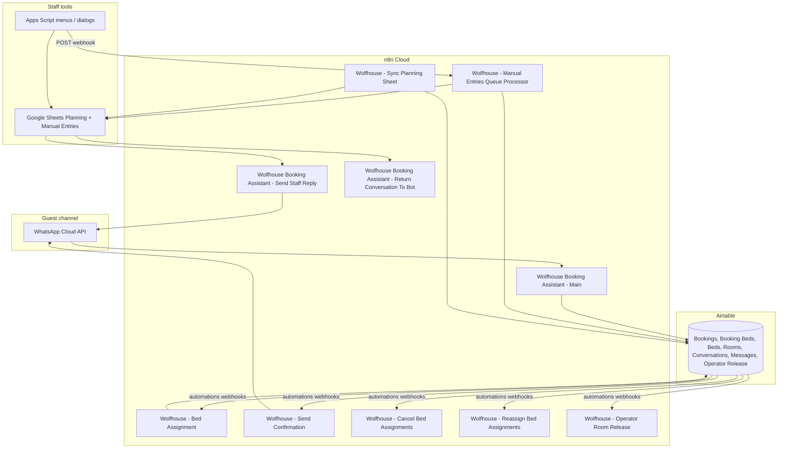

# Wolfhouse — Current System Map

> **Source of truth today:** Airtable base `appOCWIN47Bui9CSS` (Wolfhouse)  
> **Automation engine:** n8n Cloud (`tywoods.app.n8n.cloud`)  
> **Staff planning UI:** Google Sheets (`1eISph-eVZpylAEFVRS22hxRvWydBj07vz6G-vO7T_cc`) + Apps Script  
> **Guest channel:** WhatsApp Cloud API → Meta Graph API  
> **Workflow exports:** `n8n/*.json` (do not edit exports in place; import to n8n when deploying)

## High-level architecture

## Airtable tables (logical model)

| Table ID | Name | Role |
|----------|------|------|
| `tblYWm3zKFafe4qu7` | Bookings | Parent booking record; status, payment, rooming, assignment summary |
| `tblO1ByvTMXS4SalB` | Booking Beds | One row per bed assignment; availability overlap checks |
| `tblEkF4SG4TLaNmW4` | Beds | Sellable inventory units (R1-B1, …) |
| `tblrNdFnxdQvEnPuj` | Rooms | Room metadata, fill/private priority, gender strategy |
| `tbllLFnkeriks575v` | Conversations | WhatsApp session state, bot/staff mode, hold linkage |
| `tbl3oMbUtrUr0XWLt` | Messages | Inbound/outbound message log |
| `tblWslWOfwbgoQGZy` | Operator Room Release Request | Staff request to split operator whole-room blocks |

**Not present in exports (gap for Postgres migration):** dedicated Guests, Packages, or Payments tables. Guest identity is duplicated on Bookings and Conversations; packages are a single select on Bookings; payment is field-based only (no Stripe integration yet).

## Google Sheets

| Sheet | Purpose |
|-------|---------|
| `Planning` | Visual calendar grid; painted by Sync Planning Sheet |
| `Manual Entries` | Queue for staff-created bookings; synced by Manual Entries Queue Processor |

Spreadsheet ID: `1eISph-eVZpylAEFVRS22hxRvWydBj07vz6G-vO7T_cc` (see `apps-script/code.gs`).

## External services

| Service | Used by |
|---------|---------|
| Airtable API | All operational workflows |
| Google Sheets API | Manual Entries Queue Processor, Sync Planning Sheet |
| Meta WhatsApp Graph API `v20.0` | Main, Send Confirmation, Send Staff Reply |
| Anthropic (Haiku / Sonnet) | Main (parser + replies), Send Confirmation |
| n8n webhooks (internal) | Main → Reassign; Apps Script → Manual Entries |

**Not integrated yet:** Stripe Checkout / webhooks (payment link is a placeholder in Main).

## Booking lifecycle (intended)

| Stage | Booking `Status` | Typical `Assignment Status` | `Payment Status` |
|-------|------------------|----------------------------|------------------|
| Availability / hold | `Hold` | `Unassigned` | `not_requested` |
| Guest details captured | `Payment_Pending` | `Unassigned` → assigned via automation | `waiting_payment` |
| Deposit claimed manually | `Payment_Pending` | `Assigned` | `deposit_paid` (manual path) |
| Paid / confirmed | `Confirmed` | `Assigned` | `paid` |
| Staff review | `Needs_Review` | `Needs Review` | varies |
| Cancelled / expired | `Cancelled` / `Expired` | beds removed | n/a |

**Rule:** `Booking Beds` effective status is driven by parent booking (`Status (from Booking)` lookup in Airtable). Postgres design should enforce the same via application logic or triggers.

## Workflow inventory (10)

| Workflow | Trigger | Primary purpose |
|----------|---------|-----------------|
| **Wolfhouse Booking Assistant - Main** | Webhook `booking-assistant` (WhatsApp); schedule (expire holds); manual test | End-to-end WhatsApp booking agent (~80% of guest traffic target) |
| **Wolfhouse - Bed Assignment** | Webhook `assign-beds-to-booking` | Persist bed picks to Booking Beds (heavy algorithm in Code node) |
| **Wolfhouse - Manual Entries Queue Processor** | Webhook `wolfhouse-manual-entries-queue` | Sync Manual Entries sheet → Airtable create/update/delete |
| **Wolfhouse - Sync Planning Sheet** | Schedule every 30 min | Paint Planning grid from active Booking Beds |
| **Wolfhouse - Send Confirmation** | Webhook `send-confirmation` | After payment flag, confirm booking + WhatsApp message |
| **Wolfhouse - Cancel Bed Assignments** | Webhook `cancel-booking-beds` | Delete bed rows when booking cancelled |
| **Wolfhouse - Reassign Bed Assignments** | Webhook `reassign-booking-beds` | Delete beds, reset assignment, re-trigger assignment |
| **Wolfhouse - Operator Room Release** | Webhook `operator-room-release` | Split operator whole-room block into two blocks |
| **Wolfhouse Booking Assistant - Send Staff Reply** | Webhook `send-staff-reply` | Staff message from sheet → WhatsApp + Airtable |
| **Wolfhouse Booking Assistant - Return Conversation To Bot** | Webhook `return-to-bot` | Hand conversation back to bot |

## Surf packages (business)

From Manual Entries + Main parser (website marketing is general surf camp; pricing lives in ops knowledge):

| Package key | Display name |
|-------------|--------------|
| `malibu` | Malibu |
| `uluwatu` | Uluwatu |
| `waimea` | Waimea |
| `custom` | Custom |

Stripe design (separate doc) should map package + nights + guest count → Checkout line items.

## Known gaps / technical debt

1. **Payment link placeholder** in Main: `https://wolf-house.com/booking-payment-placeholder` — Stripe not wired.
2. **Duplicate bed-assignment logic:** Main runs inline availability (`Code - Check Bed Availability - WA`); Bed Assignment workflow is a separate, richer assigner triggered by Airtable (not called from Main today).
3. **Shared webhook UUID** between Manual Entries Queue and Send Confirmation nodes (`a17ba7e1-7a97-4613-9f8b-d35b50460017`) — different paths, but risky on re-import.
4. **Airtable automations** are not exported in repo — must be recreated from Airtable UI or screenshots when migrating triggers to Postgres/n8n.
5. **`docs/api keys.txt`** exists in workspace — must not be committed; rotate if exposed.
6. **Unused / legacy fields** (see `docs/airtable-field-usage.md`): `Status - OLD`, duplicate bed link fields, calendar fields not used in n8n paths reviewed.

## Target state (this repo’s migration)

- **Postgres** replaces Airtable as app DB (phased dual-write).
- **n8n** stays orchestrator; self-hosted on Azure with queue mode.
- **Google Sheets Planning** retained initially.
- **Stripe** owns “paid” truth via webhook → `payments` / `payment_events`.
