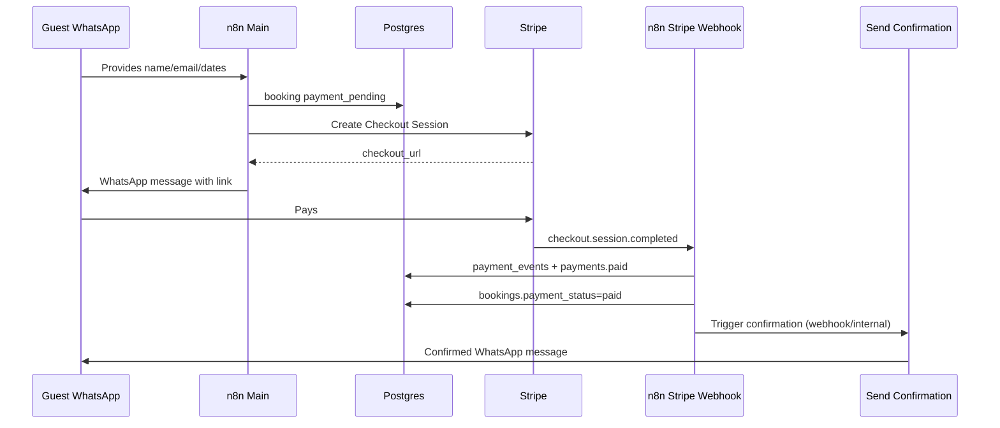

# Stripe Payment Design

## Principles

1. **Stripe Checkout Sessions** first (fastest path for Ale/Cami — hosted payment page).
2. **Only Stripe webhooks** may set `payments.status = paid` and `bookings.payment_status = paid`.
3. Staff manual “deposit paid” remains during transition; must not auto-confirm without Stripe unless flagged `manual_override`.
4. Store full audit in `payment_events`.

## Current state

Main workflow sets:

```text
Payment Link: https://wolf-house.com/booking-payment-placeholder
Status: Payment_Pending
Payment Status: waiting_payment
```

Send Confirmation searches `Send Confirmation = TRUE()` AND `Status = Payment_Pending`, then sets `Confirmed` / `paid`.

**Gap:** no cryptographic payment proof — migration must insert Stripe before relying on Send Confirmation for WhatsApp guests.

## Target flow



## Package → line items

**Source:** Wolfhouse website — **EUR per person per week** (shared). See **`docs/package-pricing.md`**.

| Season months | Malibu | Uluwatu | Waimea |
|---------------|--------|---------|--------|
| April, May, June, October | €249/wk | €349/wk | €499/wk |
| July, September | €299/wk | €399/wk | €549/wk |
| August | €349/wk | €449/wk | €599/wk |

**Proration:** `per_person = ceil_to_nearest_5(weekly × nights / 7)` then × `guest_count`.  
**Double room:** +€10 per person per night.

**Postgres:** `package_price_rules` + functions in `database/migrations/002_package_pricing.sql`.

Deposit in manual sheet (€200) stays separate until owners confirm deposit vs full prepay online.

### Pricing calculation (n8n Code node — future)

Inputs: `package_code`, `check_in`, `check_out`, `guest_count`, `hostel_id`

Output:

- `deposit_amount_cents`
- `total_amount_cents`
- `line_items[]` for Stripe

## Phase 2b n8n workflows (local — `n8n/phase2/`)

### 1. `Wolfhouse - Create Payment Session`

| Item | Detail |
|------|--------|
| Trigger | Sub-workflow call OR webhook `create-payment-session` |
| Input | `booking_id` (UUID) or `booking_code` |
| Steps | Load booking + package → Stripe API `checkout.sessions.create` → insert `payments` row → update `bookings` waiting_payment → return `checkout_url` |
| Idempotency | If open `payments` row exists with valid `checkout_url`, return existing |
| **deposit_only amount** | `deposit_required_cents` only if **> 0**; else `STRIPE_DEFAULT_DEPOSIT_CENTS` (20000). **Never** create €0 Checkout. |

Stripe metadata:

```json
{
  "client_id": "...",
  "booking_id": "...",
  "booking_code": "WH-rec...",
  "payment_kind": "deposit_only"
}
```

(`full_amount` reserved for future guest choice; Phase 2b tests via API only.)

### 2. `Wolfhouse - Stripe Webhook Handler`

| Item | Detail |
|------|--------|
| Trigger | Webhook `POST stripe-webhook` (raw body for signature) |
| Verify | `Stripe-Signature` with `STRIPE_WEBHOOK_SECRET` |
| Events | `checkout.session.completed`, `checkout.session.expired`, `payment_intent.payment_failed` |
| Writes | `payment_events` always; update `payments`; on success update `bookings` |

**Paid transition (single transaction — Phase 2b implemented):**

- Updates `payments.status`, `payments.amount_paid_cents`
- Updates `bookings.payment_status` (`deposit_paid` or `paid`), `deposit_paid_cents`, `amount_paid_cents`, `balance_due_cents`
- Sets `bookings.send_confirmation = TRUE`
- Does **not** set `bookings.status` (Send Confirmation sets Confirmed)

### 3. Wire into Main assistant

Replace placeholder URL node with call to **Create Payment Session** workflow; message template includes real `checkout_url`.

### 4. Send Confirmation trigger

Change from Airtable checkbox-only to:

- Stripe webhook sets `send_confirmation = true`, OR
- Postgres NOTIFY / n8n “Execute Workflow” after paid

Keep Airtable field during dual-write.

## Postgres tables (already in schema)

- `payments` — one active checkout per booking/deposit kind
- `payment_events` — immutable Stripe event log

## Security

- **Production:** Webhook signature mandatory on the **raw** request body (`Stripe-Signature` HMAC). Fail closed.
- **Local n8n:** Parsed JSON body breaks HMAC; use `STRIPE_WEBHOOK_SKIP_VERIFY=true` only for dev, never in production.
- Never trust guest message “I paid” without `payment_events` row (payment claim flow can *search* Stripe, not set paid)
- Use Stripe test mode until regression plan passes
- `stripe_payment_intent_id`: partial UNIQUE index (NULL allowed until webhook sets PI)

## Staff manual payments

Manual Entries sheet `Deposit Paid` → continues to set `deposit_paid` on booking during Phase 2; does **not** set Stripe `paid`. Confirmation for manual bookings: staff checks box / separate staff-only confirm workflow.

## Ale/Cami UX

- They only share the WhatsApp bot link with guests
- Stripe Dashboard for refunds (train once)
- No need to copy payment links manually once Main sends them

## Open questions for owners

1. Deposit only vs full prepayment online?
2. Exact EUR amounts per package per night?
3. Refund policy → Stripe refund workflow later?
