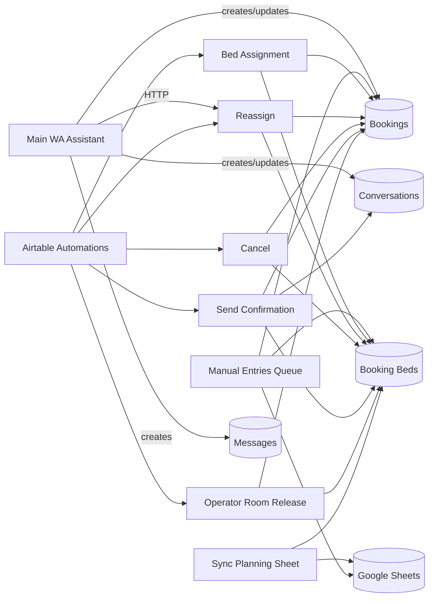

# Workflow Dependency Map

Dependencies between n8n workflows, Apps Script, Airtable automations (inferred), and Google Sheets.

## Direct n8n → n8n calls

| Caller | HTTP target | When |
|--------|-------------|------|
| **Wolfhouse Booking Assistant - Main** | `POST …/webhook/reassign-booking-beds` | Guest updates rooming on active booking (`Call Reassign Booking Beds - Rooming Update`) |
| *(none other in exports)* | — | Bed Assignment, Cancel, Send Confirmation are **not** called from Main via HTTP |

## Apps Script → n8n

| Apps Script action | Webhook |
|--------------------|---------|
| Create / update / delete manual booking | `POST …/webhook/wolfhouse-manual-entries-queue` |
| Menu: Sync Manual Entries Now | Same webhook (`action: manual_sync_button`) |

Config: `apps-script/code.gs` → `manualEntriesQueueWebhookUrl`.

## Airtable automations → n8n (documented from screenshots)

Full detail: **`docs/airtable-automations.md`** (`Screenshots/automations/`).

| Automation | Webhook path | Payload |
|--------------|--------------|---------|
| Create Booking ID | *(Airtable only)* | `Booking ID` = `WH-` + record id |
| Operator Room Release Request | `operator-room-release` | `{ record_id }` |
| Assign Beds When Booking Is Unassigned | `assign-beds-to-booking` | `{ record_id }` |
| Cancel Booking Beds When Booking Cancelled | `cancel-booking-beds` | `{ record_id }` |
| Update bed bookings when dates change | `reassign-booking-beds` | `{ record_id }` |
| Staff Reply Sent | `send-staff-reply` | `{ recordId }` |
| Return Conversation To Bot | `return-to-bot` | `{ recordId }` |
| Send Confirmation | `send-confirmation` | `{ record_id }` |

**Migration note:** Each automation becomes either (a) Postgres trigger + n8n webhook, (b) n8n schedule polling Postgres, or (c) explicit call from Main after state change.

## Google Sheets interactions

| Workflow | Sheet ops |
|----------|-----------|
| Manual Entries Queue Processor | Read `Manual Entries!A1:R1000`; update sync columns P–R |
| Sync Planning Sheet | Read `Planning!A1:ZZ120`; clear/append sync tab; `batchUpdate` paint |
| Send Staff Reply / Return To Bot | Driven from Airtable buttons/fields (`Send Staff Reply`, `Return To Bot`) linked to sheet UI |

## Data dependency graph

## Per-workflow documentation

### 1. Wolfhouse Booking Assistant - Main

| Attribute | Value |
|-----------|-------|
| **File** | `n8n/Wolfhouse Booking Assistant  - Main.json` |
| **Trigger** | Webhook `POST booking-assistant` (WhatsApp payload); Schedule `Delete Expired Holds (6hrs)`; Manual `First Msg` test |
| **Airtable** | Bookings, Booking Beds (search only), Beds, Rooms, Conversations, Messages |
| **Google Sheets** | None |
| **External APIs** | WhatsApp Graph API, Anthropic |
| **Purpose** | Parse guest messages, manage holds, check availability inline, collect guest details, set `Payment_Pending`, staff handoff, payment claim flow |
| **Important nodes** | `Webhook2`, `Parser Node`, `Merge Session State`, `Code - Check Bed Availability - WA`, `Create Booking Hold`, `Update Hold With Guest Details`, `IF - Existing Hold`, `Call Reassign Booking Beds - Rooming Update`, `Delete Expired Holds` chain |
| **Fragile areas** | Large monolith (167 nodes); duplicated assignment logic vs Bed Assignment workflow; placeholder payment URL; session JSON merge edge cases; test phone hardcoded in manual trigger |
| **Depends on** | Reassign workflow (HTTP); Airtable automations likely for actual bed row creation |
| **Preserve on migration** | Session state schema, routing intents, rooming rules, status enums, conversation memory, `Booking ID` format (`WH-rec…`) |

### 2. Wolfhouse - Bed Assignment

| Attribute | Value |
|-----------|-------|
| **Trigger** | Webhook `POST assign-beds-to-booking` |
| **Payload** | `$json.body.record_id` → Get Booking |
| **Airtable** | Bookings, Booking Beds, Beds, Rooms |
| **Purpose** | Run `Code - Choose Beds` (~23k chars), create Booking Bed rows, update Assignment Status |
| **Important nodes** | `Assign Beds to Booking - Webhook`, `Get Booking`, `Code - Choose Beds`, `Create Booking Bed Assignment`, `Update Booking Assignment Status`, conflict branch |
| **Fragile areas** | Complex scoring; operator whole-room block path; gender/room preference edge cases; relies on Airtable linked records for overlap formula |
| **Depends on** | Airtable automation trigger (not Main) |
| **Preserve** | Assignment notes format, `Assignment Type` values, conflict → `Needs Review` |

### 3. Wolfhouse - Manual Entries Queue Processor

| Attribute | Value |
|-----------|-------|
| **Trigger** | Webhook `POST wolfhouse-manual-entries-queue` |
| **Airtable** | Bookings, Booking Beds, Beds |
| **Google Sheets** | Manual Entries read/write |
| **Purpose** | Process one queue row: create/update/cancel booking + beds; mark sheet synced |
| **Important nodes** | `Code - Pick Next Manual Queue Item`, `Switch` on action, bed validation code nodes |
| **Fragile areas** | Row number ↔ sheet range math; throws if bed IDs missing; single-item-per-run |
| **Depends on** | Apps Script webhook |
| **Preserve** | Manual Entry ID format `MAN-…`, sheet columns P–R sync status |

### 4. Wolfhouse - Sync Planning Sheet

| Attribute | Value |
|-----------|-------|
| **Trigger** | Schedule every **30 minutes** |
| **Airtable** | Booking Beds search (non-cancelled/non-expired) |
| **Google Sheets** | Clear + append sync sheet; HTTP paint Planning |
| **Purpose** | Staff calendar visualization |
| **Important nodes** | `Code - Prepare Bookings Sync Rows`, `Code - Build Planning Grid Paint Request`, `HTTP - Paint Planning Grid` |
| **Fragile areas** | Large grid batchUpdate; date/bed coordinate mapping in code |
| **Depends on** | Airtable assignment dates |
| **Preserve** | Color semantics (see Apps Script `colors` config) |

### 5. Wolfhouse - Send Confirmation

| Attribute | Value |
|-----------|-------|
| **Trigger** | Webhook `POST send-confirmation` |
| **Airtable** | Bookings search (`Send Confirmation` + `Payment_Pending`), Conversations, Booking Beds |
| **External** | WhatsApp + Anthropic confirmation copy |
| **Purpose** | Set `Confirmed` / `paid`, send WhatsApp welcome |
| **Important nodes** | `Search Bookings - Send Confirmation`, `Update Booking - Confirmed`, `Send confirmation reply`, `Send WhatsApp Reply4` |
| **Fragile areas** | Duplicate webhookId with Manual Entries; assumes phone on booking; LLM text fallback chain |
| **Depends on** | Airtable automation or manual flag `Send Confirmation` |
| **Preserve** | `Send Confirmation` flag behavior until Stripe replaces it |

### 6. Wolfhouse - Cancel Bed Assignments

| Attribute | Value |
|-----------|-------|
| **Trigger** | Webhook `POST cancel-booking-beds` |
| **Payload** | `body.record_id` |
| **Purpose** | Delete all linked Booking Beds; set assignment fields to Needs Review |
| **Important nodes** | `Get Cancelled Booking`, `Delete Booking Beds Assignments` |

### 7. Wolfhouse - Reassign Bed Assignments

| Attribute | Value |
|-----------|-------|
| **Trigger** | Webhook `POST reassign-booking-beds` |
| **Called from** | Main (rooming updates) |
| **Purpose** | Delete existing bed assignments; reset booking assignment state for re-run of Bed Assignment |
| **Important nodes** | `Get Booking To Reassign`, `Cancel Old Booking Bed`, `Mark Booking Ready For Reassignment` |

### 8. Wolfhouse - Operator Room Release

| Attribute | Value |
|-----------|-------|
| **Trigger** | Webhook `POST operator-room-release` |
| **Payload** | `body.record_id` (release request) |
| **Purpose** | Find operator whole-room booking, cancel, split into Block A / Block B bookings |
| **Important nodes** | `Get Release Request`, `Search Matching Operator Booking`, `Code - Prepare Split Operator Blocks` |

### 9. Wolfhouse Booking Assistant - Send Staff Reply

| Attribute | Value |
|-----------|-------|
| **Trigger** | Webhook `POST send-staff-reply` |
| **Payload** | `body.recordId` (conversation) |
| **Purpose** | Send staff WhatsApp message; log outbound message; update conversation |

### 10. Wolfhouse Booking Assistant - Return Conversation To Bot

| Attribute | Value |
|-----------|-------|
| **Trigger** | Webhook `POST return-to-bot` |
| **Payload** | `body.recordId` |
| **Purpose** | Set conversation bot-active again |
